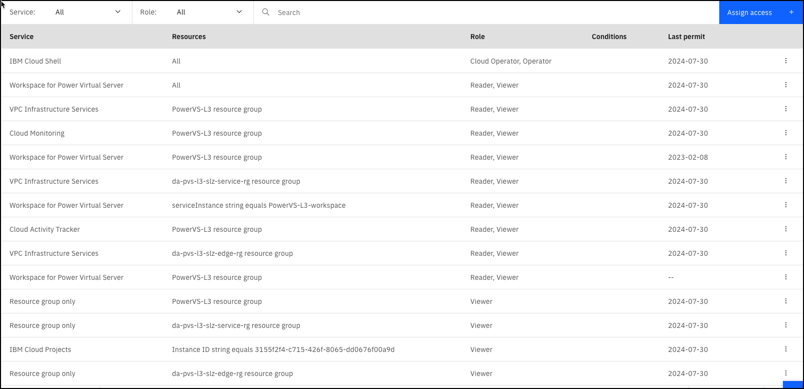

# SalesEnablement-PowerVS-L3
This repository is for IBM Sales Enablement Level 3 content for IBM Power Virtual Server (PowerVS).

**ITZ Collection:** https://techzone.ibm.com/collection/ibm-power-systems-virtual-server-level-3

**ITZ Environment:** https://techzone.ibm.com/my/reservations/create/62f54d401543eb0018e026b7

**ITZ gitops pattern:** https://github.ibm.com/dte2-0/ccp-gitops-patterns/tree/main/ibm-powervs-se-l3

ITZ account: ITZ - ADHOC03

## Summary of environment and automation

For this lab, no new IBM Cloud resources are provisioned as part of the ITZ automation The lab consists of many click-thru demonstrations, a pre-provisioned PowerVS workspace and 3 PowerVS VMs. **There appears to be an issue with the ITZ automation when reservations expire or are deleted. Users are remaining in the account and in the security group. The instructions below are provided to clean up "leftover" users.**

In the ITZ automation:

- users are added to the above ITZ account
- users are added to the PowerVS-L3 IAM access group. Users only have the permissions specified below in the ITZ IBM Cloud account. The users cannot create any additional cloud resources. The access group has the following access roles/policies defined:



- An SSH key is created for the user. The private key is provided to the user via ITZ (via reservation page), and the public key is added to the PowerVS VMs that are pre-provisioned in the environment.

**Note if new PowerVS VSIs must be provisioned**  

In November 2023, the ITZ automation for this lab started breaking. We were able to resolve by changing the MTU size of the public internet facing devices:

On AIX:
```
chdev -l en0 -a mtu=1476
```
On Linux:

```
nmcli conn modify "System env2" -a 802-3-ethernet.mtu 1476
nmcli conn up "System env2"
```
Apparently the max MTU PowerVS VSIs is 1476, however this worked for the first year this lab was deployed. We still aren't quite sure why this needed to be done since it was working before.

## Maintenance

**To perform the maintenance steps below, you must have admin access in the ITZ IBM Cloud account: 2305900 - iTZ - ADHOC03.**

Verify the following resources are available in the account:

**PowerVS Workspace:** PowerVS-L3-2024
**PowerVS Virtual Machines (VMs):** AIX-vm-1, AIX-vm-2, RH-vm-1, RH-vm-2 (these are all provisioned in the above workspace)
**Boot images:** RH-golden-boot-image, AIX-golden-boot-image (these are only used as examples for users to view)

1. the ITZ automation may fail with a reservation expires and leave users in the cloud account. Run the following commands/scripts in IBM Cloud Shell or on your machine if you have the IBM Cloud CLI's installed (along with VPC plugin). The script assumes you are authenticated (ibmcloud login -sso). It will also remove any stray users (interactively). You could also do this manually through the IBM Cloud Portal.

```
wget -O itzPowerVSMaintenance.perl https://raw.githubusercontent.com/IBM/SalesEnablement-PowerVS-L3/main/tools/itzPowerVSMaintenance.perl

chmod +x itzPowerVSMaintenance.perl

perl ./itzPowerVSMaintenance.perl
```


2. In some cases the ITZ automation doesn't remove the users from the the PowerVS VMs when the reservation expires or is deleted. The steps below and associated scripts will help remove old user IDs and their home directories. Make sure you run step 1 above first and clear out any inactive users from the cloud account as we will use the list of "active" users to make sure we don't delete their accounts on the 4 machines. You will want to do all the substeps below quickly to minimize possibility of someone creating a reservation between running "getActiveReservations" and "cleanUpUsers".

```
wget -O getActiveReservations.perl https://raw.githubusercontent.com/IBM/SalesEnablement-PowerVS-L3/main/tools/getActiveReservations.perl
wget -O cleanUpUsers.perl https://raw.githubusercontent.com/IBM/SalesEnablement-PowerVS-L3/main/tools/cleanUpUsers.perl

chmod +x getActiveReservations.perl

perl getActiveReservations.perl
```

The getActiveReservations.perl file will generate a "activeReservations.txt" file. 
You will need to copy this file and the cleanUpUsers.perl script to each of the 4 VMs. Below should be the current IP addresses for the VMs.
You must have the root ssh key (PowerVSKey) for this to work. Andrew Jones (andrewj@us.ibm.com) has that key.

```
scp -i PowerVSKey activeReservations.txt root@169.59.159.92:/tmp/
scp -i PowerVSKey cleanUpUsers.perl root@169.59.159.92:/tmp/
scp -i PowerVSKey activeReservations.txt root@169.59.174.14:/tmp/
scp -i PowerVSKey cleanUpUsers.perl root@169.59.174.14:/tmp/
scp -i PowerVSKey activeReservations.txt root@169.59.174.12:/tmp/
scp -i PowerVSKey cleanUpUsers.perl root@169.59.174.12:/tmp/
scp -i PowerVSKey activeReservations.txt root@169.59.174.13:/tmp/
scp -i PowerVSKey cleanUpUsers.perl root@169.59.174.13:/tmp/
scp -i PowerVSKey activeReservations.txt root@150.239.207.226:/tmp/
scp -i PowerVSKey cleanUpUsers.perl root@150.239.207.226:/tmp/
scp -i PowerVSKey activeReservations.txt root@150.239.207.227:/tmp/
scp -i PowerVSKey cleanUpUsers.perl root@150.239.207.227:/tmp/
```

Next, you need to ssh to each of the VMs and execute the cleanUpUsers.perl script. This is an interactive script that will prompt you if you
want to delete a user that is NOT in the activeReservations.txt file. If you trust the script, you can run it like the second sample below.

```
perl /tmp/cleanUpUsers.perl
```

```
no | perl /tmp/cleanUpUsers.perl # this will say n for each delete to let you see what will be deleted before you run with yes
yes| perl /tmp/cleanUpUsers.perl
```

When done, you can remove the 2 files.

```
rm /tmp/cleanUpUsers.perl /tmp/activeReservations.txt
```

3. There is a cronjob that runs on each of the 2 AIX PowerVS VMs that empties the /etc/security/failedlogin file. This file fills up quickly due to the fact these machines are running on the public Internet and folks try to get in. Check each VM to make sure the crontjob is still there and make sure no filesystem is filling up.  The cronjob is:

```
0 15 * * *  > /etc/security/failedlogin 2>&1
```
