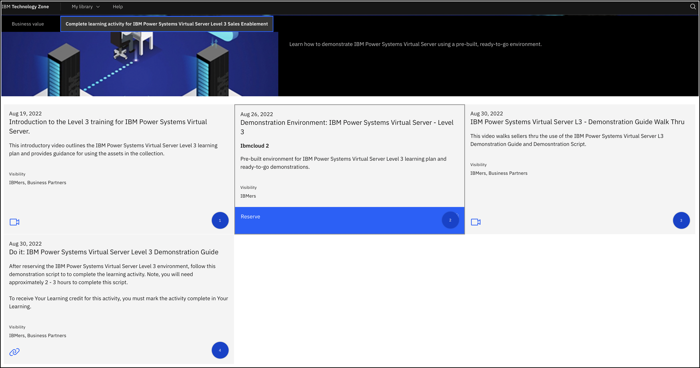

!!! tip "Ways to Watch"
    In addition to the embedded video, IBMers and Business Partners can also <a href="https://ibm.seismic.com/Link/Content/DChpTqJ8dqGH68QMBF6jMVQC92gG" target="_blank">download the recording from Seismic</a>.

**IBM Power Systems Virtual Server** (PowerVS) delivers flexible compute capacity for Power Systems workloads. Integrated with the IBM Cloud platform for on-demand provisioning, this offering provides a secure and scalable server virtualization environment built upon the advanced RAS features and leading performance of the Power Systems platform.

You should be familiar with PowerVS and should have completed the IBM Power Systems Virtual Server Sales Foundation Badge (Level 2) before embarking on the Level 3 content. The content here is **not** a replacement for the Level 1 and 2 content that is part of the previous learning plans, which are linked in the documentation accompanying this course.

- **IBM:** <a href="https://yourlearning.ibm.com/activity/PLAN-4E64FE2FDBF0" target="_blank">https://yourlearning.ibm.com/activity/PLAN-4E64FE2FDBF0</a>
- **Business Partners:** <a href="https://learn.ibm.com/course/view.php?id=11419" target="_blank">https://learn.ibm.com/course/view.php?id=11419</a>

This demonstration environment has multiple purposes. First, it is meant to educate you on IBM Power Systems Virtual Server (PowerVS) and to hone your skills to perform PowerVS demonstrations. Additionally, the IBM Technology Zone (TechZone) environment, this demonstration guide and associated click-thru demos and videos can be re-used to perform client demonstrations.

Primarily, our goal is to focus on the Infrastructure as a Service capability of PowerVS and not on the operating systems supported by the offering: AIX, IBM i, and Linux. Throughout the course, you will:

- In **Parts 1, 2, and 3**, learn how the demonstration environment was built, and how to perform a "baking show" style demonstration using the IBM Cloud Portal, click-thru demonstrations, and videos. New PowerVS resources are not provisioned as part of this demonstration guide. All resources are pre-provisioned in a shared environment to save time and money.
- In **Part 4**, learn how to use the IBM Cloud Portal to manage PowerVS instances.
- In **Part 5**, learn how to access the pre-provisioned PowerVS instances using IBM Cloud Shell.
- **Parts 1 through 5** provide a good foundation for performing a high-level, customer facing demonstration of IBM Power Systems Virtual Server.
- **Parts 6 and 7** introduce several more technical aspects of IBM Power Systems Virtual Server including using the PowerVS IBM Cloud command line interface (CLI) plugin.
- Finally, in **Part 8**, learn where to find additional resources about IBM Power Systems Virtual Server, and how to complete the IBM Power Systems Virtual Server - Level 3 badge.

!!! tip "Remember to reserve your demonstration environment"
    The following instructions will help you get started. You should reserve your environment ahead of time so that the instance has time to provision before you reach the hands-on sections of the lab material.

1. If you have not already done so, go to the <a href="https://techzone.ibm.com/collection/ibm-power-systems-virtual-server-level-3" target="_blank">IBM Technology Zone collection for PowerVS L3</a> and click the tab (at the top of the page) labeled "Complete Learning Activity for IBM Power Systems Virtual Server Level 3 Sales Enablement," as shown in the following screenshot.

2. Click the **Demonstration Environment** tile that has the blue **Reserve** icon to create a request for a PowerVS instance.

3. Select the **Reserve Now** option.

- Rename the instance to something unique to you. For example, 'Bienko-PowerVS-L3'.
- Set the value of **Purpose** to **Practice / Self-Education**.
- Write a brief note into the **Purpose Description** field explaining what the environment is to be used for.
- Under the **Preferred Geography** field, select **Dallas 13** (or another location closer to you, if available).
- Specify the **End Date and Time** when your reservation will expire. You can reserve the environment for up to 72 hours.

When satisfied, scroll down to the bottom of the page and click **Submit** to initiate the environment provisioning request.

4. You will now need to wait for IBM Technology Zone to finish provisioning your PowerVS environment — this process takes approximately 5 to 10 minutes. When ready, you will receive an email to your IBM address _and_ the <a href="https://techzone.ibm.com/my/reservations" target="_blank">Reservations</a> page will show a PowerVS tile with the status of **Ready**. If marked as ready, click anywhere on the tile to drill down into details on how to access your cluster.

!!! important
    If you click the PowerVS tile before it is marked as Ready (for example, if it shows as "scheduled" or "provisioning") the details needed to connect to the cluster will either be unavailable or incomplete. You must wait until the environment is **Ready** before continuing to the next step.

5. After drilling down into the readied PowerVS tile, look towards the bottom of the page for a blue icon labelled as **Download SSH Private Key**, which contains the SSH key pair you will need to connect to the PowerVS environment over the IBM Cloud Shell. **Click** the blue icon and download the SSH key to your local downloads folder.

6. Just above the blue icon is a field labelled as **User ID** — record that value, as it will be needed later. It should look something like your email address (but with a period . instead of an @ sign).

7. Log in to your email inbox and look for an email from **IBM Cloud** with the title **Account: You are invited to join an account in IBM Cloud**. Within the content of the email is a link to **Join Now**. Click the link and then **Accept** the invitation on the IBM Cloud portal. This will add the PowerVS instance to your IBM Cloud account.

