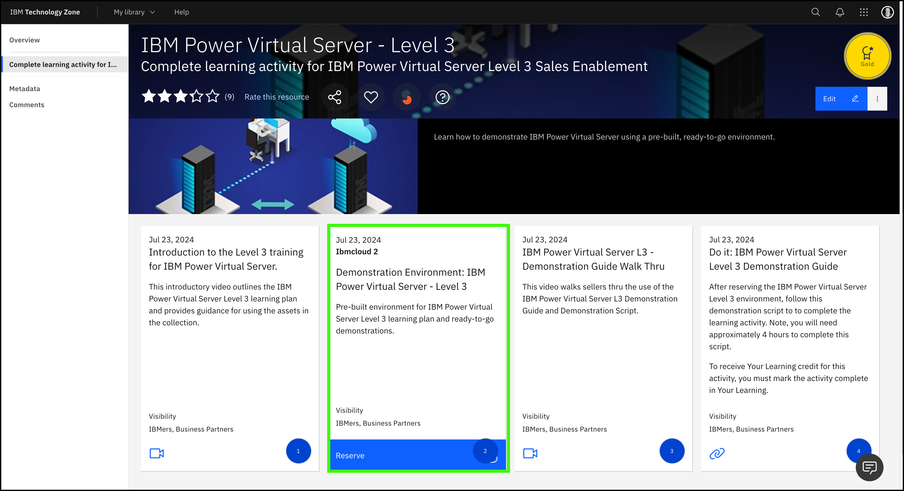

The steps that follow outline how to reserve access to the pre-provisioned, IBM Technology Zone (ITZ) demonstration environment.

!!! tip "Remember, reserve the demonstration environment in IBM Technology Zone"
    Reserve an IBM Technology Zone environment ahead of time so that the instance has time to provision.

1. Open a browser to the <a href="https://techzone.ibm.com/collection/ibm-power-virtual-server-level-3" target="_blank">IBM Technology Zone collection for PowerVS L3</a> and click "Complete Learning Activity for IBM Power Virtual Server Level 3 Sales Enablement," as shown.

    

2. Click the **Demonstration Environment** tile that has the blue **Reserve** icon request for a reservation.

    

3. Select **Reserve Now**.

    

4. Complete the required fields for the reservation.

    a. Provide the instance a unique name. For example, 'AndrewJ-PowerVS-L3'.
  
    b. Set the value of **Purpose** to **Education**.
  
    c. Write a brief note into the **Purpose Description** field.
  
    d. Under the **Preferred Geography** field, select **itzadhoc03 - AMERICAS - us-south region - dal13 datacenter** (or a closer location if available).
  
    e. Specify the **End Date and Time** for the reservation. The default reservation is for two days. You can extend the reservation for up to an extra four days.

    

5. When satisfied, scroll down and (a) accept the terms and conditions and then (b) click **Submit** to initiate the environment provisioning request.

    

6. Wait for IBM Technology Zone to finish provisioning the PowerVS environment. The automation takes approximately 5 to 10 minutes. When ready, an email is sent _and_ the <a href="https://techzone.ibm.com/my/reservations" target="_blank">Reservations</a> page shows a PowerVS tile with the status of **Ready**. If marked as ready, click anywhere on the tile to drill down into details of the reservation.

    

    !!! Important
        Clicking the PowerVS tile before it is marked as Ready (for example, if it shows as "scheduled" or "provisioning") displays incomplete data. Wait until the environment is **Ready** before you continue to the next step.

7. Click the reservation tile.

    

8. Locate the **User ID** field and record this value. It is needed later. It looks like your email address that was used to request the environment but with a period instead of an *at* sign (@).

    

9. Click **Download SSH Private Key**.

    This SSH key is used later to access the PowerVS virtual server instances.

    !!! tip "Record the file name and location!"
    
        The private key file is used later when accessing virtual machines on PowerVS.

    

10. Review the emails received. One is from **IBM Cloud** with the title **Account: You are invited to join an account in IBM Cloud**. In the body of the email is a **Join Now** link. Click the link and **Accept** the invitation on the IBM Cloud portal.

    If you do not receive an e-mail, try deleting the existing reservation in ITZ and try creating a new one. If that doesn't work, open a support ticket in the #itz-techzone-support Slack channel.  Include the reservation ID and summarize the problem in your message.

    

Now that you have an active ITZ reservation, you can proceed. Remember, the default duration of the reservation is 2 days. You can extend the reservation for up to an extra four days. IBMers will need an active reservation to record their stand and deliver, and business partners will want it to complete the short quiz as part of the Level 3 learning plan.