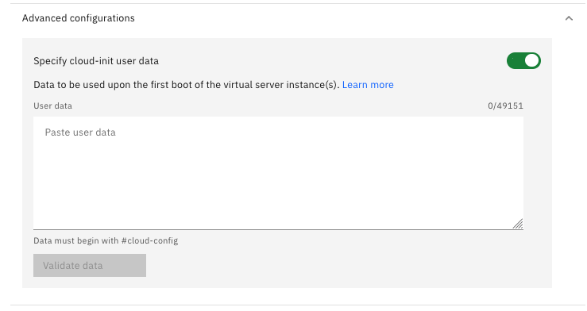

Use the click through demonstration below to practice provisioning an IBM i virtual server instance (VSI).

!!! Important

    If you skipped the Part 3 Introduction and are not familiar with the features of PowerVS like storage pools, storage tiers, etc. you should consider going back and reading it.  

Note: Access to provision a new VSI is not provided in the IBM Technology Zone cloud account. Use this click through demonstration to simulate this activity. Fields that require a text entry are pre-populated in the click through demonstration.

!!! tip
    Not sure where to click or what to do next? Click anywhere on the screen and the spot to click next is highlighted.

1. Open the following link and then click play  to begin the demonstration.

    **Click through demonstration:** <a href="https://ibm.github.io/SalesEnablement-test-repo/includes/Provision-IBMiVM/index.html" target ="_blank">Create an IBM Power Virtual Server Instance</a>

2. Click **{{powerVS.serviceInstanceName}}** in **Workspaces** table.
3. Click **View virtual servers**.
4. Click **Create instance +**.

The next steps refer to the entries in the **General** section of the **Create virtual server instance** form.

5. Click the **Instance name** field.
6. Click the **Add to a server placement group** information icon () and read the helpful information.
7. Click the information dialog to close it.
8. Click the **Add to a shared processor pool** information icon () and read the helpful information.
9. Click the information dialog to close it.
10. Click the **Virtual server pinning** information icon () and read the helpful information.
11. Click the information dialog to close it.
12. Click the **Select virtual server pinning** pull-down.
13. Click **None**.
14. Click the **Select SSH key** pull-down.
15. Click **{{powerVS.sshKey}}**.
16. Click **Continue** in the **General** section.

The next steps refer to the entries in the **Boot image** section of the **Create virtual server instance** form.

17. Click the **Select OS** pull-down.
18. Click **IBM i**.
20. Click the **Select image** pull-down.
21. Click **IBMi-75-03-2924-2**.
22. Click the **Tier** pull-down.
23. Click **Tier 3 (3 IPOs/GB)**.
24. Click the **IBM i Licenses** information icon () and read the helpful information.
25. Click the information dialog to close it.

??? Note "Change in IBM Cloud Portal"

    During the creation of this course, a new feature was added to PowerVS that is not reflected in this click through demonstration. The **Advanced configurations** option allows users to specify **cloud-init user data**. 
    
    
    
    This data is used when the VSI is first booted. This capability only applies to Full Linux Subscription boot images. Learn more about these user defined scripts <a href="https://cloud.ibm.com/docs/power-iaas?topic=power-iaas-full-linux-sub#cloud-init-fls-private-cloud" target="_blank>here</a>. Learn more about Full Linux Subscription (FLS) <a href="https://cloud.ibm.com/docs/power-iaas?topic=power-iaas-set-full-Linux" target="_blank">here</a>.

26. Click the **Continue** button under the **Boot image** section.

The next steps refer to the entries in the **Profile** section of the **Create virtual server instance** form.

27. Click the **Select machine type** pull-down.
28. Click **s1022**.
29. Click the **Core type** information icon () and read the helpful information.
30. Click the information dialog to close it.
31. Click the **Cores** information icon () and read the helpful information.
32. Click the information dialog to close it.
33. Click **Continue** under the **Profile** section.

The next steps refer to the entries in the **Storage volumes** section of the **Create virtual server instance** form.

34. Click **Create volume +**.
35. Click the **Name in VSI** field.
36. Click **+** to increase the size of the volume to 2 GB.
37. Click the **Tier** pull-down (set to **Tier 3 (3 IOPs/GB)** by default).
38. Click **Tier 3 (3 IOPs/GB)**.
39. Click **Create and attach**.
40. Click **Continue** under the **Storage volumes** section.

The next steps refer to the entries in the **Network interfaces** section of the **Create virtual server instance** form.

Note: for this demonstration, the instance is provisioned with a public network (internet facing). A public network simplifies demonstrating access to instances. However, most production deployments of PowerVS use private networks and control access with Direct Link, Virtual Private Network (VPN), or Megaport Software Defined Network (SDN). To learn more about PowerVS networking options, look <a href="https://cloud.ibm.com/docs/power-iaas?topic=power-iaas-network-architecture-diagrams" target="_blank">here</a>.

41. Toggle **Public networks** to **On**.
42. Click **Attach +**.
43. Click the **Select Network** pull-down.
44. Click **{{powerVS.privateSubnet}}**.
45. Click **Attach**.
46. Click **Finish** under the **Network interfaces** section.
47. Click **I agree to the Terms and conditions**.
48. Click **Create**.

The IBM i PowerVS instance is now being provisioned. This process took approximately 15 minutes. Notice the value under the **Status** column of the **Virtual server instances** table. When the status changes to an **Active** state, the instance is ready to be accessed. For IBM i instances, there are additional steps that must be completed to accept the IBM software licenses that are deployed as part of the base image. These steps are documented <a href="https://cloud.ibm.com/docs/power-iaas?topic=power-iaas-configuring-ibmi" target="_blank">here</a>.
