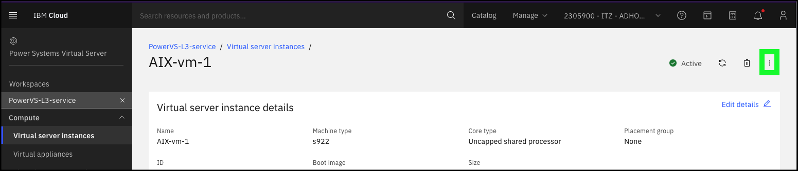

Using the IBM Cloud portal and command-line interfaces (CLIs), users can do the following actions on individual IBM Power Virtual Servers (PowerVS) instances (VSIs):

- Shutdown an operating system (OS)
- Immediate shutdown (without killing processes gracefully) of an OS
- Restart
- Open a console to the instance
- Delete an instance
- Capture and export an image of an instance
- Modify a VSI
    - Change the name of the VSI
    - Change virtual server pinning policy
    - Add or remove cores
    - Add or remove memory
    - Modify placement group
- Add or remove volumes
- Modify network interfaces (can require OS changes)

!!! Important "Options vary"
    Options vary depending on the OS and options that are specified for the VSI. 

Using the IBM Cloud portal, complete the following scenario for managing PowerVS instances by using the "baking show" demonstration technique. Note, an error message like the following one is encountered if an attempt is made to complete an action.

An error is expected, as full access to the shared environment is **not** provided. To avoid the error message, click **Cancel** on the action dialog. During a live client demonstration, or for an IBMers Stand and Deliver, tell the audience why the action is being canceled but explain what happens when the action is completed.

1. Open the IBM Cloud Portal: <a href="https://cloud.ibm.com/" target="_blank">https://cloud.ibm.com/</a> and authenticate.
2. Change to the **{{account}}** account.

    

    !!! Tip
        If the browser window is narrow, this icon:  is seen instead of the current account name as shown in the previous screen capture.

<!-- 3. Click **Services and software** under **Resource summary** on the IBM Cloud Dashboard. -->

3. Click the hamburger menu icon (**A**)

    

    !!! Note
        
        After switching accounts a new user questionnaire or other dialogs can appear. Cancel these windows. If the IBM Cloud Dashboard is not displayed as seen in the previous image, click the **IBM Cloud** text at upper left of the IBM Cloud Portal.
   
5. Click **Resource List**  (**A**)

    

6. Click **{{powerVS.serviceInstanceName}}** (**A**) under **Compute**.

    

7. Click **{{aixServer1.name}}** (**A**) in the **Virtual server instances** table.

    

8. Click the **VM actions** (**A**) pull-down.

    

    Notice the actions that can be initiated. The actions available vary depending on the current state of the instance and the operating system of the instance.

    ??? Error "Don't see a **VM actions** button?"

        If the browser window is too small, the reactive nature of the IBM Cloud Portal will change the **VM actions** button to an ellipses icon . Click the ellipses icon to see the **VM actions** or expand the browser window horizontally.

        

9. Click anywhere on the main screen (away from the menu from step 7).
10. Click the **VM actions** (**A**) drop-down menu and select **Capture and export** (**B**). 
    

11. The dialog describes two distinct forms within the interface:
     - Capture Contents Form: This form facilitates the selection of storage volumes intended for export. The selected volumes can be exported either to the PowerVS service image catalog or to IBM Cloud Object Storage (COS).
     - Destination Form: This form enables the specification of the export destination. Based on the selected destination, additional input fields are dynamically displayed. These fields allow for the configuration of parameters such as the image name (for the image catalog) or COS-specific details including region, bucket name, access key, and other relevant credentials.
    
     

     

     

13. In this demonstration environment, full access to the IBM Cloud account is NOT provided. Any attempt to complete an action, will result in an error. Click **Cancel** (**A**) in the "Capture and export virtual server" dialog to close it and return back to the VSI details view page.
    

14. Click the **Edit details** (**A**) link.

    

    Explore what instance configuration options can be modified. Depending on the running state of the instance, some options are not accessible. Note, changing the instance always requires the user to agree to the service terms.

15. Click **Cancel** (**A**) in the **Edit virtual server instance details** dialog to close it.
    

!!! Example "On your own"
    The preceding steps walked through two aspects of managing a single PowerVS instance with the AIX operating system. Explore the **Edit** options available for the VSIs running Linux and IBM i. Notice any differences?

Before proceeding, take a few minutes exploring other aspects of managing PowerVS instances by using the IBM Cloud Portal. Detailed steps are not provided, but typically you can click the **Cancel** button to return to the instances detail page. A few things to try from any of the instances' detail pages:

- In **Attached volumes** section, click **Attach existing** (**A**). Notice how only existing volumes that are marked as **shareable** are displayed.
  

- In **Attached volumes** section, click **Create volume**. Notice that it is now possible to add a **Storage volume** that uses a different tier of storage than the instance boot volume.
  

- In **Network interfaces** section, **Private networks** sub-section, click **Attach existing network** (**A**). Notice how it shows existing private subnets. A VSI can be attached to one or more private subnets.
  

