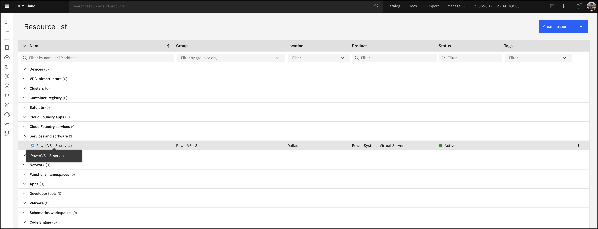
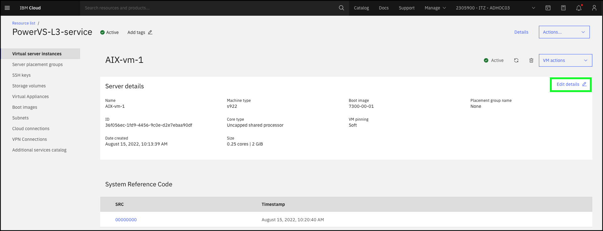

Through the IBM Cloud Portal or APIs, administrators with the appropriate IBM Cloud Portal access can manipulate PowerVS instances without needing to directly access the instance operating system.

Using the IBM Cloud portal, complete the following scenario for managing PowerVS instances using the "baking show" demonstration technique. Note, an error message like the one below will be encountered if an attempt is made to complete an action.

This is normal, as full access to the shared environment is **not** provided. To avoid the error message, simply click the **Cancel** button on the action dialog. If performing a live client demonstration, or for IBM employees completing the Stand and Deliver for the {{learningplan.name}} badge, tell the audience why the action is being canceled but explain what would typically happen if the action was completed.

1. Open the IBM Cloud Portal: <a href="https://cloud.ibm.com/" target="_blank">https://cloud.ibm.com/</a> and authenticate.
2. Change to the **{{account}}** account.

!!! tip
    If the browser window is narrow, this icon:  may be seen instead of the current account name as shown in the screen capture above.

<!-- 3. Click **Services and software** under **Resource summary** on the IBM Cloud Dashboard. -->

3. Click the **Resource List**  icon in the left-hand menu bar.

!!! Note
    In some cases, after switching accounts a new user questionnaire and/or other pop-up window may appear. Simply cancel these windows. If a the IBM Cloud Dashboard is not displayed as seen in the above figure, click the **IBM Cloud** text at top left of the IBM Cloud Portal.

4. Click **{{powerVS.serviceInstanceName}}** under **Services and software**.

5. Click **{{aixServer1.name}}** in the **Virtual server instances** table.

6. Click the **VM actions** pull-down.

Notice the actions that can be initiated. The actions available will vary depending on the current state of the instance and the operating system of the instance.

7. Click anywhere on the main screen (away from the pop-up menu from step 6).
8. Click the **Edit details** link.

Explore what instance configuration options can be modified. Depending on the running state of the instance, some options may not be possible. Note, making changes to the instance always requires the user to agree to the service terms. **Hint**: Business Partners should take note of why the **core type** of the virtual instance cannot be edited.

9. Click **Cancel** in the **Edit server details** dialog.

The above steps walked through two aspects of managing a single PowerVS instance.

Before proceeding, spend a few minutes exploring other aspects of managing PowerVS instances using the IBM Cloud Portal. Detailed steps are not provided, but typically just click the **Cancel** button to return to the instances detail page. Here are a few things to try:

- Click **Attach volume**. Notice how only existing volumes that are marked as **shareable** are displayed.
- Click **Create volume**. Notice it is now possible to add a **Storage volume** using a different tier of storage than that of the instance boot volume.
- Click the **VM actions** drop-down menu and select **Capture and export**. From this dialog, the storage volumes can be exported to either the PowerVS service Image catalog or to IBM Cloud Object Storage. **Hint**: Business Partners should take note of the **Limited actions available during capture** information dialog that appears on the **Capture and export** panel.
