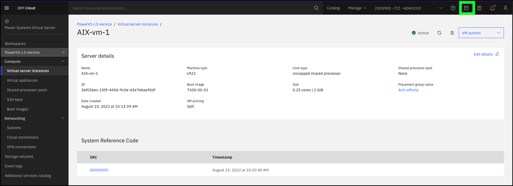
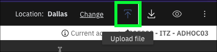
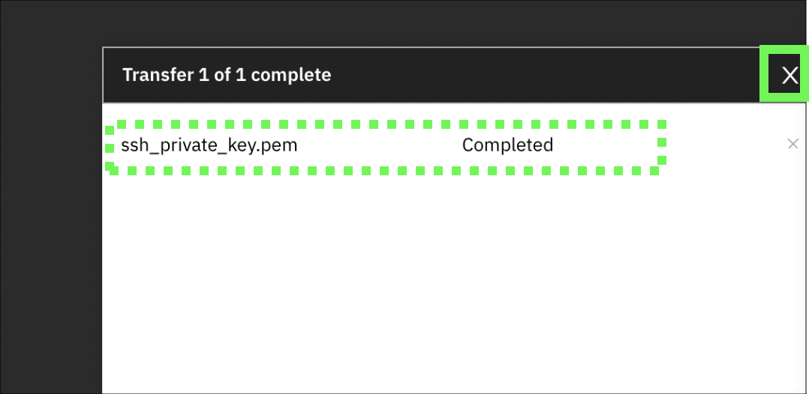
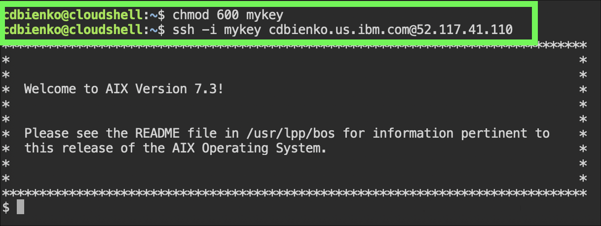

Accessing a PowerVS instance will depend on several factors, including the operating system the instance is running and the network connectivity available. Remote login tools like Secure Socket Shell (SSH), telnet, and other terminal emulators can be used to access instances. PowerVS also provides access to running instances using a web-based console tool. In most cases, clients will deploy PowerVS instances using a secured network like Direct Link or Virtual Private Network (VPN). Learn more about the PowerVS network connectivity options <a href="https://cloud.ibm.com/docs/power-iaas?topic=power-iaas-about-virtual-server#public-private-networks" target="_blank">here</a>.

For this exercise, the IBM Cloud Shell will be used so no additional software is required. IBM Cloud Shell gives users complete control of their cloud resources, applications and infrastructure, from any web browser. IBM Cloud Shell provides pre-authenticated access to the latest tools and programming languages for cloud-based development, deployment and management of services and applications — all in a secure shell. IBM Cloud Shell is instantly accessible from the IBM Cloud portal.

To quickly demonstrate the value of PowerVS, this demonstration environment and all running instances are provisioned with a public, Internet facing network interface.

Follow the steps below to log in to a running PowerVS instance using the IBM Cloud Shell and SSH. You can learn more about SSH and SSH keys <a href="https://en.wikipedia.org/wiki/Secure_Shell" target="_blank">here</a>.

1. Change to the **ITZ - ADHOC03** account using the drop-down switcher, as shown in the GIF below.


!!! tip
    If the browser window is narrow, this icon:  may appear instead of the current account name as shown in the screen capture above.

2. Click the IBM Cloud Shell icon .



??? error "Get an error openingIBM Cloud Shell?"

    If the following error occurs when attempting to open IBM Cloud Shell, fix it by either deleting the browser cookies for cloud.ibm.com and log back into cloud.ibm.com, or try using a private/incognito browser window.

    

The next steps are performed in using the IBM Cloud Shell window that was just opened.

3. In the top-right corner of the IBM Cloud Shell window is a square icon with an "up" arrow. Click this button to upload a file — upload the SSH key downloaded earlier.



!!! tip "Did you record the file name and location?"
    
    Earlier, when the key was downloaded the filename may have been different than **ssh_private_key.pem**. In the next steps, be sure to use the name the file was saved as when downloaded. If the file was saved with any special characters (e.g. **ssh_private_key (1).pem**) it is recommended to change the filename to something without any special characters to avoid issues when uploading the file to the IBM Cloud Shell environment.

Locate the **.pem** file in  Downloads folder specified earlier and  wait for the transfer to finish. A dialogue box will appear in the bottom-right corner of the IBM Cloud Shell window when the upload is complete.



4. With the Private SSH Key now uploaded into the IBM Cloud Shell environment, we need to decode it to base64 and— for ease of reference later —assign the key a simple name such as **mykey**. Do so by issuing the following command into the IBM Cloud Shell prompt at the bottom of the window:

```
base64 --decode ssh_private_key.pem > mykey
```

5. Now adjust the access permissions on the **mykey** file using the following command:

```
chmod 600 mykey
```

6. We are now ready to remotely connect (SSH) to the PowerVS demonstration environment. Do so with the following command, substituting **<your_user_id>** for the value recorded in <a href="https://ibm.github.io/SalesEnablement-PowerVS-L3/Part%201/01%20Introduction/" target="_blank">Part 1 - Step 6</a>. A prompt asking whether to continue connecting may appear; if so, type **Yes** and then hit Return/Enter. Ignore the message regarding authenticity of the host not being established.

```
ssh -i mykey <your_user_id>@{{aixServer1.publicIP}}
```

!!! info "Sample output"
    

7. Try running a few OS level commands using the following commands.

```
ls -laR
```

```
who
```

```
ps -ef
```

All of these commands are basic OS commands. If familiar with AIX or Linux, feel free to try other things out on the instance. Note, users of the shared environment have limited permissions on the PowerVS instances. Administrative access is not provided.

8. Close the SSH connection by running the **exit** command.

```
exit
```

To explore further, use the following public IP addresses to access the other PowerVM instances:

| Instance name | Instance public IP address |
| ------------- | -------------------------- |
| {{aixServer1.name}} | {{aixServer1.publicIP}} |
| {{aixServer2.name}} | {{aixServer2.publicIP}} |
| {{rhServer1.name}} | {{rhServer1.publicIP}} |
| {{rhServer2.name}} | {{rhServer2.publicIP}} |


Use the ```ssh -i mykey UserName@IPaddress``` command to connect to the other servers. Be sure to replace **UserName** with the **UserName** field found in the TechZone reservation, and **IPaddress** with the instance's public IP address from the table above.

Technical sellers should proceed to Part 6 and explore PowerVS server placement groups, volumes, subnets, and additional services.

That concludes the required parts of the demonstration script for IBM and Business Partners Sales. All are encouraged to complete Parts 6 and 7, but at this time IBM and Business Partners Sales may skip to [**Part 8 - Next steps**](../Part 8/01 Next steps.md).
