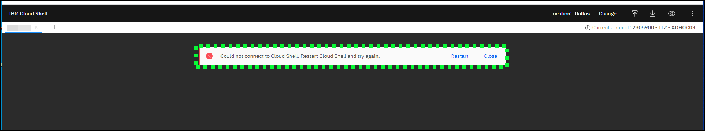

Accessing an IBM Power Virtual Server (PowerVS) virtual server instance (VSI) depends on several factors, including the operating system the instance is running and the network connectivity available. Remote login tools like Secure Socket Shell (SSH), telnet, and other console emulators can be used to access instances. PowerVS also provides access to running instances by using a web-based console tool. Usually, clients deploy PowerVS instances that use a secured network like Direct Link or Virtual Private Network (VPN). Learn more about the PowerVS network connectivity options <a href="https://cloud.ibm.com/docs/power-iaas?topic=power-iaas-on-cloud-architecture#public-private-networks" target="_blank">here</a>.

For this exercise, the IBM Cloud Shell is used so no additional software is needed. IBM Cloud Shell gives users complete control of their cloud resources, applications, and infrastructure, from any web browser. IBM Cloud Shell provides pre-authenticated access to the tools and programming languages for secure, cloud-based development, deployment, and management of services and applications. IBM Cloud Shell is instantly accessible from the IBM Cloud portal. Learn more about IBM Cloud shell <a href="https://cloud.ibm.com/docs/cloud-shell?topic=cloud-shell-getting-started" target="_blank">here</a> and <a href="https://www.ibm.com/products/cloud-shell" target="_blank">here</a>.

To quickly demonstrate the value of PowerVS, this demonstration environment and all running instances are provisioned with a public, internet facing network interface.

Use the following steps to log in to a PowerVS instance by using the IBM Cloud Shell and SSH. Learn more about SSH and SSH keys <a href="https://en.wikipedia.org/wiki/Secure_Shell" target="_blank">here</a>.

1. Change to the **ITZ - ADHOC03** account by using the drop-down switcher.

    

    !!! Tip

        If the browser window is narrow, this icon:  appears instead of the current account name as shown in the previous screen capture.

2. Click the IBM Cloud Shell icon  (**A**).

    

    ??? Error "Get an error opening IBM Cloud Shell?"

        If the following error occurs when attempting to open IBM Cloud Shell, fix it by either deleting the browser cookies for cloud.ibm.com and log back into cloud.ibm.com, or try using a private/incognito browser window. 

3. A new IBM Cloud shell window should open.
   

Use the IBM Cloud Shell window that was opened in the next steps.

4. In the upper-right of the IBM Cloud Shell window is a square icon with an "up" arrow. Click this icon (**A**) and upload the SSH key downloaded earlier.

    

    !!! tip "Did you record the file name and location?"
    
        Earlier, when the key was downloaded the filename may have been different than **ssh_private_key.pem**. In the next steps, be sure to use the name the file was saved as when downloaded. If the file was saved with any special characters (e.g. **ssh_private_key (1).pem**) it is recommended to change the filename to something without any special characters to avoid issues when uploading the file to the IBM Cloud Shell environment.

5. Locate the **.pem** (**A**) file in the Downloads folder, select it and click **Open** (**B**) and wait for the transfer to finish.
   

7. A dialog box appears in the lower-right of the IBM Cloud Shell window when the upload is complete. Click **X** (**A**) to close the dialog.

    

4. In the IBM Cloud shell, run the following command to adjust the access permissions on the **ssh_private_key.pem** file:

    ```
    chmod 600 ssh_private_key.pem
    ```
    <br>
    
    

5. You are now ready to remotely connect (SSH) to the PowerVS demonstration environment. Do so with the following command, substituting **<your_user_id\>** for the **User ID** value recorded in <a href="https://ibm.github.io/SalesEnablement-PowerVS-L3/Part%201/02%20Reserve/" target="_blank">Part 1 - Step 7</a>. If a prompt asks whether to continue connecting type **Yes** and then press Return or Enter. Ignore the message about the authenticity of the host not being established.

    ```
    ssh -i ssh_private_key.pem <your_user_id>@{{aixServer1.publicIP}}
    ```

    !!! info "Sample output"
   
        

7. Try running a few OS-level commands by using the following commands.

    ```
    ls -laR
    ```

    ```
    who
    ```

    ```
    ps -ef
    ```

    All of these commands are basic OS commands. If you are familiar with AIX or Linux, try out other commands. Remember, your permissions in the shared environment are limited. Administrative access is not provided.

8. Close the SSH connection by running the **exit** command. Control will return back to the IBM Cloud shell.

    ```
    exit
    ```
    <br>
    
    

To explore further, use the following public IP addresses to access the other VSIs:

| Instance name | Instance public IP address |
| ------------- | -------------------------- |
| {{aixServer1.name}} | {{aixServer1.publicIP}} |
| {{linuxServer1.name}} | {{linuxServer1.publicIP}} |

Use the ```ssh -i ssh_private_key.pem UserName@IPaddress``` command to connect to the other servers. Be sure to replace **UserName** with the **UserName** field found in the TechZone reservation, and **IPaddress** with the instance's public IP address from the preceding table.

!!! note "Access to IBM i VSI"

    At this time, this environment does not allow users to access the VSI running IBM i. IBM i access is typically done using a terminal emulator and would require additional software and setup. If you need to demonstrate accessing an IBM i system, you will need to provision an instance in an IBM Cloud account where you have full access. 
