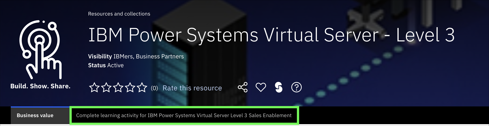
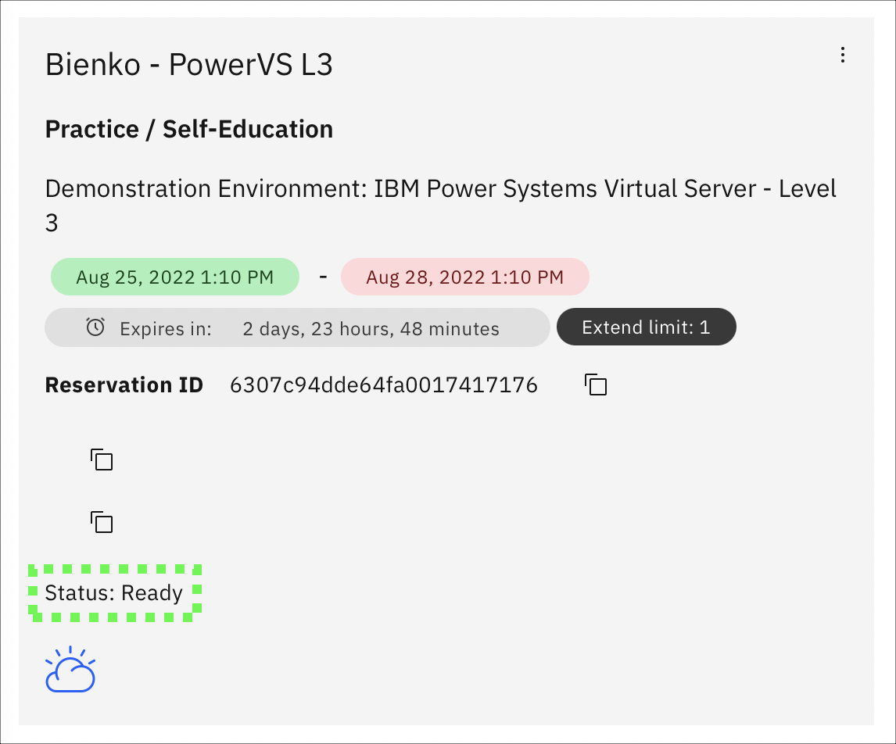
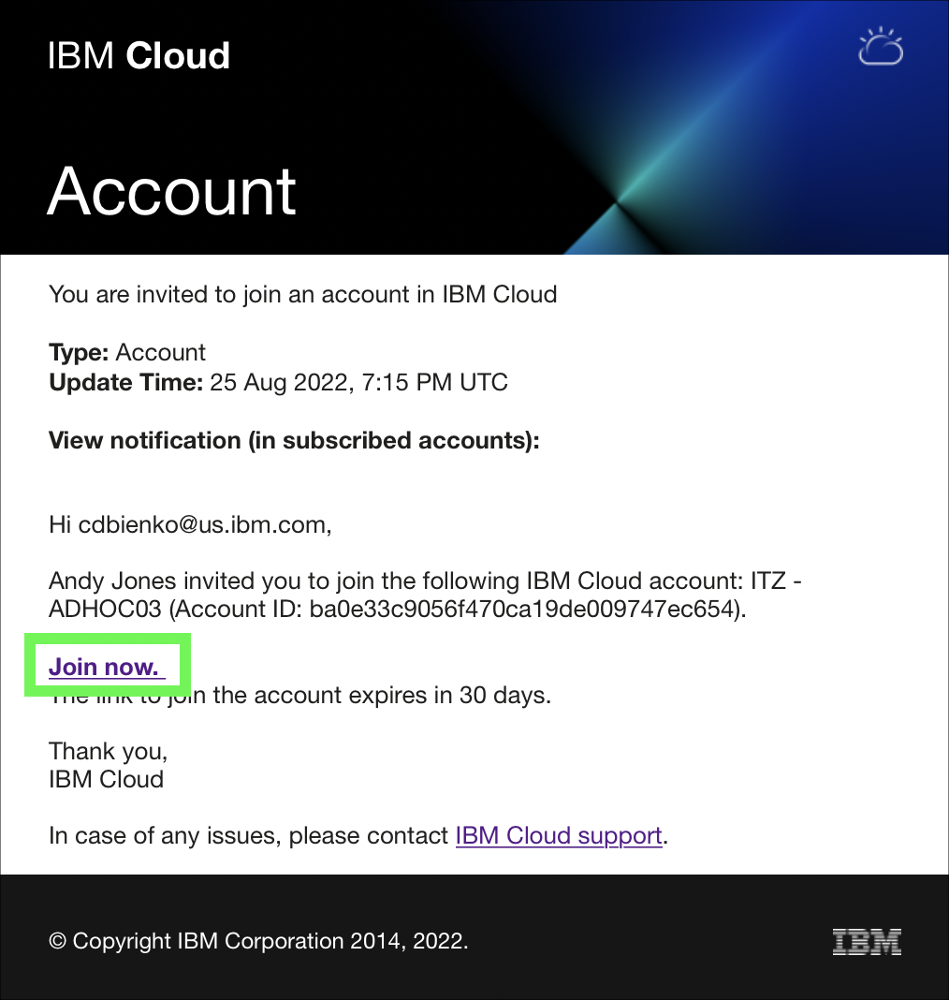

Accessing a PowerVS instance will depending on several factors, including the operating system the instance is running and the network connectivity available. Remote login tools like Secure Socket Shell (SSH), telnet, and other terminal emulators can be used to access instances. PowerVS also provides access to running instances using a web-based console tool. In most cases, clients will deploy PowerVS instances using a secured network like Direct Link or Virtual Private Network (VPN). Learn more about the PowerVS network connectivity options <a href="https://cloud.ibm.com/docs/power-iaas?topic=power-iaas-about-virtual-server#public-private-networks" target="_blank">here</a>.

For this exercise, the IBM Cloud Shell will be used so no additional software is required. IBM Cloud Shell gives users complete control of their cloud resources, applications and infrastructure, from any web browser. IBM Cloud Shell provides pre-authenticated access to the latest tools and programming languages for cloud-based development, deployment and management of services and applications — all in a secure shell. IBM Cloud Shell is instantly accessible from the IBM Cloud portal.

To quickly demonstrate the value of PowerVS, this demonstration environment and all running instances are provisioned with a public, Internet facing network interface.

Follow the steps below to log in to a running PowerVS instance using the IBM Cloud Shell and SSH. You can learn more about SSH and SSH keys <a href="https://en.wikipedia.org/wiki/Secure_Shell" target="_blank">here</a>.


1. If you have not already done so, go to the <a href="https://techzone.ibm.com/collection/ibm-power-systems-virtual-server-level-3" target="_blank">IBM Technology Zone collection for PowerVS L3</a> and click the tab (at the top of the page) labeled "Complete Learning Activity for IBM Power Systems Virtual Server Level 3 Sales Enablement," as shown in the following screenshot.



2. Click the **Demonstration Environment** tile that has the blue **Reserve** icon to create a request for a PowerVS instance.


3. Select the **Reserve Now** option.

- Rename the instance to something unique to you. For example, 'Bienko-PowerVS-L3'.
- Set the value of **Purpose** to **Practice / Self-Education**.
- Write a brief note into the **Purpose Description** field explaining what the environment is to be used for.
- Under the **Preferred Geography** field, select **Dallas 13** (or another location closer to you, if available).
- Specify the **End Date and Time** when your reservation will expire. You can reserve the environment for up to 72 hours.

When satisfied, scroll down to the bottom of the page and click **Submit** to initiate the environment provisioning request.


4. You will now need to wait for IBM Technology Zone to finish provisioning your PowerVS environment — this process takes approximately 5 to 10 minutes. When ready, you will receive an email to your IBM address _and_ the <a href="https://techzone.ibm.com/my/reservations" target="_blank">Reservations</a> page will show a PowerVS tile with the status of **Ready**. If marked as ready, click anywhere on the tile to drill down into details on how to access your cluster.


!!! important
    If you click the PowerVS tile before it is marked as Ready (for example, if it shows as "scheduled" or "provisioning") the details needed to connect to the cluster will either be unavailable or incomplete. You must wait until the environment is **Ready** before continuing to the next step.

5. After drilling down into the readied PowerVS tile, look towards the bottom of the page for a blue icon labelled as **Download SSH Private Key**, which contains the SSH key pair you will need to connect to the PowerVS environment over the IBM Cloud Shell. **Click** the blue icon and download the SSH key to your local downloads folder.


6. Just above the blue icon is a field labelled as **User ID** — record that value, as it will be needed later. It should look something like your email address (but with a period . instead of an @ sign).

7. Log in to your email inbox and look for an email from **IBM Cloud** with the title **Account: You are invited to join an account in IBM Cloud**. Within the content of the email is a link to **Join Now**. Click the link and then **Accept** the invitation on the IBM Cloud portal. This will add the demonstration PowerVS instance to your IBM Cloud account.



8. Change from your IBM Cloud account to the **ITZ - ADHOC03** account using the drop-down switcher, as shown in the GIF below.


!!! tip
    If your browser window is narrow, you may see this icon:  instead of the current account name as shown in the screen capture above.

9. Click the IBM Cloud Shell icon .


The next steps are performed in using the IBM Cloud Shell window that was just opened.

10. In the top-right corner of the IBM Cloud Shell window is a square icon with an "up" arrow. Click this button to upload a file — in this case, we will be uploading the SSH key you downloaded earlier in **Step 5**.


Locate the **.pem** file in your Downloads folder (or in the directory you saved it to previously) and then wait for the upload to finish. A dialogue box will appear in the bottom-right corner of the IBM Cloud Shell window letting you know when the upload is complete.


11. With the Public SSH Key now uploaded into the IBM Cloud Shell environment, we need to decode it to base64 and— for ease of reference later —assign the key a simple name such as **mykey**. Do so by issuing the following command into the IBM Cloud Shell prompt at the bottom of the window:

```
base64 --decode ssh_private_key.pem > mykey
```

12. Now adjust the access permissions on the **mykey** file using the following command:

```
chmod 600 mykey
```

13. We are now ready to remotely connect (SSH) to the PowerVS demonstration environment. Do so with the following command, substituting **<your_user_id>** for the value recorded in **Step 6**. You may receive a prompt asking whether you wish to continue connecting; if so, type **Yes** and then hit Return/Enter.

```ssh -i mykey <your_user_id>@52.117.41.110```

!!! info "Sample output"
    

14. Try running a few OS level commands using the following commands.

```
ls -laR
```

```
who
```

```
ps -ef
```

All of these commands are basic OS commands. If you are familiar with AIX or Linux, feel free to try other things out on the instance. Note, your user ID has limited permissions on all PowerVS instances in this shared environment. Administrative access is not provided.

15. Run one more OS level command. **Hint**: Business Partners should record the command's output.

```
uname -a
```

16. Close the SSH connection by running the **exit** command.

```
exit
```

To explore further, use the following public IP addresses to access the other PowerVM instances:

| Instance name | Instance public IP address |
| ------------- | -------------------------- |
| {{aixServer1.name}} | {{aixServer1.publicIP}} |
| {{aixServer2.name}} | {{aixServer2.publicIP}} |
| {{rhServer1.name}} | {{rhServer1.publicIP}} |
| {{rhServer2.name}} | {{rhServer2.publicIP}} |


Use the ```ssh -i mykey UserName@IPaddress``` command to connect to the other servers. Be sure to replace **UserName** with the **UserName** field found in your TechZone reservation, and **IPaddress** with the instance's public IP address from the table above.

That concludes the required parts of the demonstration script for IBM and Business Partners Sales. You are encouraged to complete Parts 6 and 7, but at this time you may skip to [**Part 8 - Next steps**](../Part 8/01 Next steps.md).

Technical sellers: proceed to the next part and explore PowerVS server placement groups.
