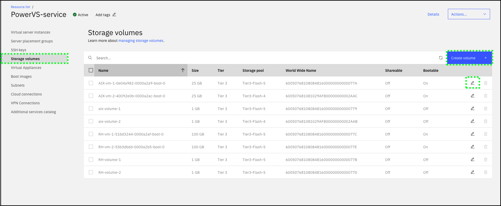
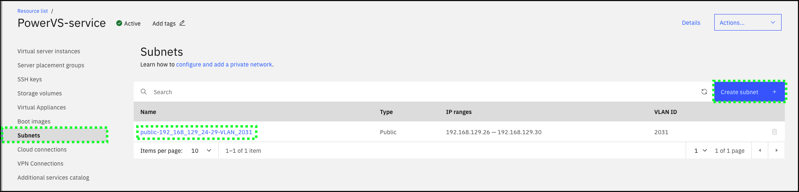
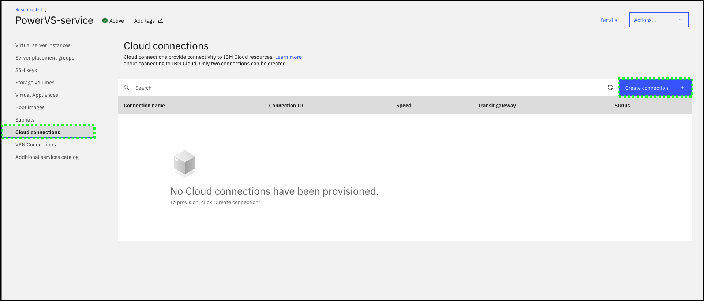
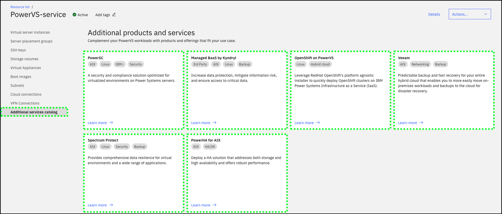

In the earlier Parts of this demonstration script, you probably noticed additional features for managing other aspects of PowerVS instances. Below are brief introductions to some of those topics and links to more detailed information for each. Additionally, high level guidance of how to explore these topics using the IBM Cloud Portal are provided.

##Server placement groups, affinity, and anti-affinity

Server placement groups provide control over the host or server on which a new instance is placed. By using server placement groups, high availability within a data center can be achieved. When a placement group is set with an affinity policy, all instances in that placement group are launched on the same physical server. When a placement group is set with an anti-affinity policy, all instances in that placement group are launched on different servers.

A few facts about server placement groups:
- By default, there is a maximum of 25 server placement groups. A support ticket needs to be raised to go beyond this limit.
- The IBM Cloud Portal for server placement groups can only be used if the cloud account has less than 100 instances. If the account has > 100 instances, the command line interfaces (CLI) or application programming interfaces (API) must be used to create server placement groups.

In the TechZone environment,
- Explore the **Server placement groups** page in the IBM Cloud Portal.
  
- Drill down into the server placement groups that have already been created.
  

Learn more about server placement groups <a href="https://cloud.ibm.com/docs/power-iaas?topic=power-iaas-placement-groups" target="_blank">here</a>.

Learn more about High Availability (HA) and Disaster Recovery (DR) options in PowerVS <a href="https://cloud.ibm.com/docs/power-iaas?topic=power-iaas-ha-dr" target="_blank">here</a>.

##Storage volumes, boot volumes, and images

As mentioned earlier PowerVS supports both Tier 1 and Tier 3 storage volumes. Every instance consists of a boot volume and optionally additional storage volumes. While IBM manages the underlying physical storage, it is the client's responsibility to manage and protect the data on instances.

A few facts about storage volumes:
- Storage volumes can be increased in size in 1GB increments, but not decreased.
- Storage volume sizes maximums will depend on availability within the selected IBM datacenter.
- Storage volumes can be marked as **shareable**.
- Storage volumes can be marked as **bootable**.
- Affinity and anti-affinity rules can be applied to storage volumes.

A few facts about boot volumes/images:
- Boot volumes can be imported from IBM Cloud Object Storage (COS).
- Boot volumes can be exported to IBM COS.
- Affinity and anti-affinity rules can be applied to boot volumes.
- Boot volumes (and storage volumes) of running instances can be captured (also know as a snapshot) to either the local image catalog associated with the PowerVS service or to IBM COS.
- Captured boot images can be used to provision new instances.

In the TechZone environment,
- Explore the **Storage volumes** page in the IBM Cloud Portal.
  
- Explore the **Boot images** page in the IBM Cloud Portal.
  

Learn more about storage volumes <a href="https://cloud.ibm.com/docs/power-iaas?topic=power-iaas-modifying-server#modifying-volume-network" target="_blank">here</a>.

Learn how to import a boot image <a href="https://cloud.ibm.com/docs/power-iaas?topic=power-iaas-importing-boot-image" target="_blank">here</a>.

##Subnets, Cloud connections, and VPN connections

A few facts about subnets:
- A Classless inter-domain routing (CIDR) must be specified when creating a subnet.
- The first IP address in the CIDR is always reserved for the gateway in all data centers.
- The second and third IP addresses are reserved for gateway high availability (HA) in only the PowerVS colocation in the Washington, DC 04 datacenter (WDC04).

A few facts about Cloud connections:
- Cloud Connect (Managed Networking Services using Megaport) is available only in USA.
- A maximum of 2 connections can be created.
- A subnet must be created prior to creating a Cloud connection.

A few facts about VPN connections:
- A maximum of 4 connections can be created.
- A subnet must be created prior to creating a Cloud connection.

In the TechZone environment,
- Explore the **Subnets** page in the IBM Cloud Portal.
  
- Explore the **Cloud connections** page in the IBM Cloud Portal.
  
- Explore the **VPN connections** page in the IBM Cloud Portal.
  

Learn more about subnets <a href="https://cloud.ibm.com/docs/power-iaas?topic=power-iaas-configuring-subnet" target="_blank">here</a>.

Learn more about Cloud connections <a href="https://cloud.ibm.com/docs/power-iaas?topic=power-iaas-cloud-connections" target="_blank">here</a>.

Learn how to configure a VPN connection <a href="https://cloud.ibm.com/docs/power-iaas?topic=power-iaas-VPN-connections" target="_blank">here</a>.

##Additional services catalog

Complimentary products and services are available for {{offering.name}}.

In the TechZone environment,
- Explore the **Additional services catalog** page in the IBM Cloud Portal.
  

In the next Part, learn about the PowerVS command line interfaces (CLI).
