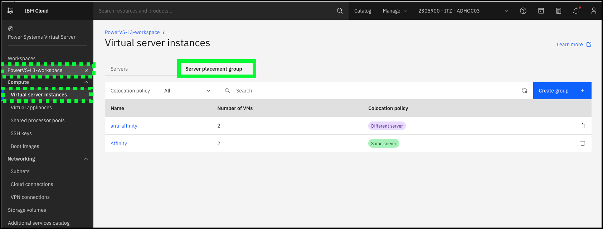

Server placement groups provide control over the host or server on which a new instance is placed. By using server placement groups, high availability within a data center can be achieved. When a placement group is set with an affinity policy, all instances in that placement group are launched on the same physical server. When a placement group is set with an anti-affinity policy, all instances in that placement group are launched on different servers.

A few facts about server placement groups:

  - By default, there is a maximum of 25 server placement groups. A support ticket needs to be raised to go beyond this limit.
  - The IBM Cloud Portal for server placement groups can only be used if the cloud account has less than 100 instances. If the account has > 100 instances, the command line interfaces (CLI) or application programming interfaces (API) must be used to create server placement groups.

!!! warning "Portal errors when viewing Placement Groups"
    A recent issue has arisen regarding placmenet groups. A support ticket has been created with IBM Cloud to address the issue. When loading the Placement Groups page the following errors are reported.  While the problem is being worked, please skip this chapter of the demonstration guide and proceed to learn more about Volumes.
    

In the TechZone environment:

  - Explore the **Server placement groups** page in the IBM Cloud Portal.
  

Learn more about server placement groups <a href="https://cloud.ibm.com/docs/power-iaas?topic=power-iaas-placement-groups" target="_blank">here</a>.

Learn more about High Availability (HA) and Disaster Recovery (DR) options in PowerVS <a href="https://cloud.ibm.com/docs/power-iaas?topic=power-iaas-ha-dr" target="_blank">here</a>.
