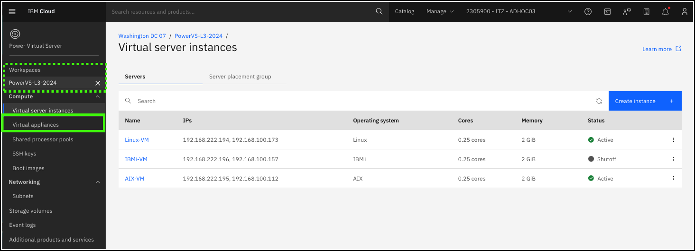
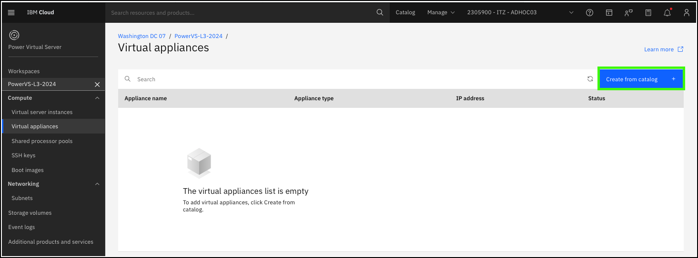
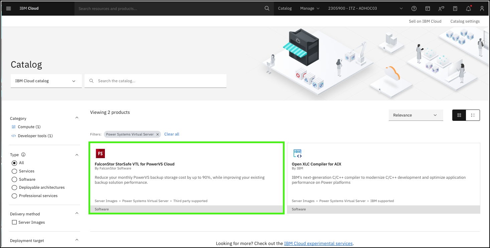
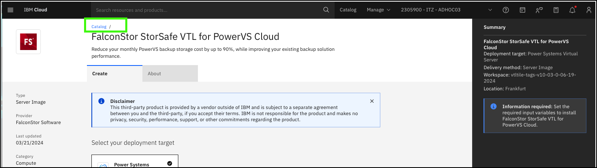
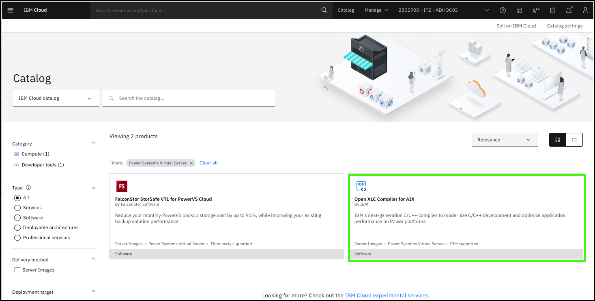
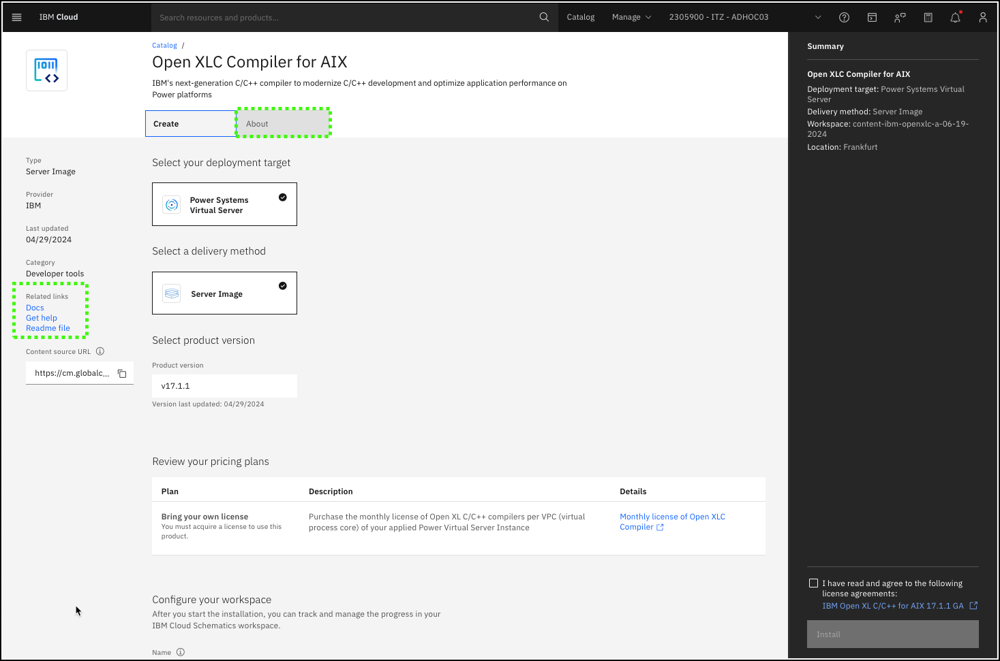

??? Important "Important information about the demonstration environment!"
    In this demonstration environment, full access to the IBM Cloud account is NOT provided. In the steps that follow, you will not have the ability to create, edit, or delete resources in the IBM Technology Zone environment.

Virtual appliances are pre-configured virtual machine images that can easily be provisioned in an IBM Power Virtual Server (PowerVS) workspace. 

1. Click **Virtual appliances** option in the side menu under the {{powerVS.serviceInstanceName}} workspace.

    

2. Click **Create from catalog +**.

    

    A new browser tab opens to the IBM Cloud catalog. The currently available virtual appliances are displayed. As of July 2024, 2 virtual appliances are available in the IBM Cloud catalog for PowerVS.

    

3. Click the **FalconStor StorSafe VTL for PowerVS Cloud** tile.

    

    FalconStor StorSafe Virtual Tape Library (VTL) is a software solution that optimizes backup and restore to improve performance and significantly reduce backup storage costs, all without requiring changes to the existing requirement. With its integrated deduplication, the solution removes redundant copies of data, reduces capacity requirements, decreases storage costs, and minimizes replication and restore times. StorSafe VTL can be used with all leading backup solutions, enables both hybrid and cloud native backup, and supports both workload and tape migration to the cloud. 

    Review the provisioning page for FaclonStor StorSafe VTL for PowerVS Cloud. Notice the **Required input variables** and **Optional input variables** sections and the values that are used to configure the virtual appliance. These include parameters like the number of vCPUs, memory, and storage tier. Also note the **About** tab and links to additional information.

    

    After all required fields are defined, clients can provision the virtual appliance. The automation provisions the required virtual server instance by using a base image with the FaclonStor software already installed and configured. When complete, the FalconStor solution is ready to be used.

4. Click **Catalog**.

    

5. Click the **Open XLC Compiler for AIX** tile.

    

    IBM® Open XL C/C++ for AIX is IBM’s next-generation C/C++ compiler that facilitates the creation and maintenance of applications that are written in C/C++ for IBM Power. Taking advantage of the Power10 architecture, IBM Open XL C/C++ for AIX can generate code that uses the capabilities of Power10 to maximize hardware utilization.

    Explore the provisioning page and additional information available for the virtual appliance.

    

Recall, the virtual appliance catalog was opened in a new browser tab or window. When ready, close the current browser tab or window to return to the IBM Cloud Portal virtual appliances page.