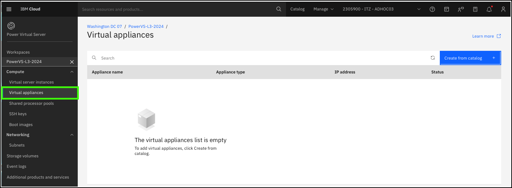
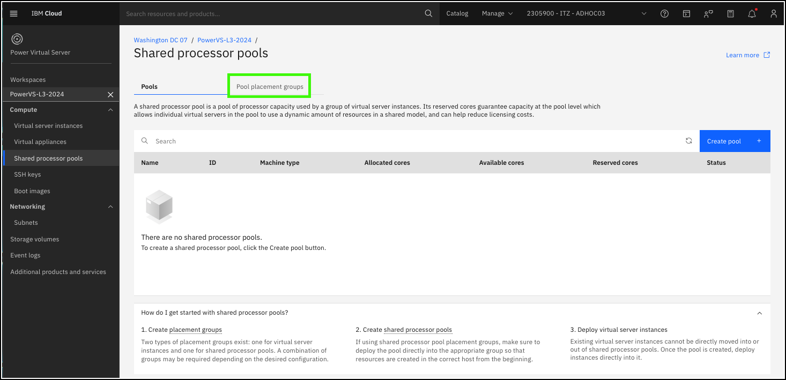
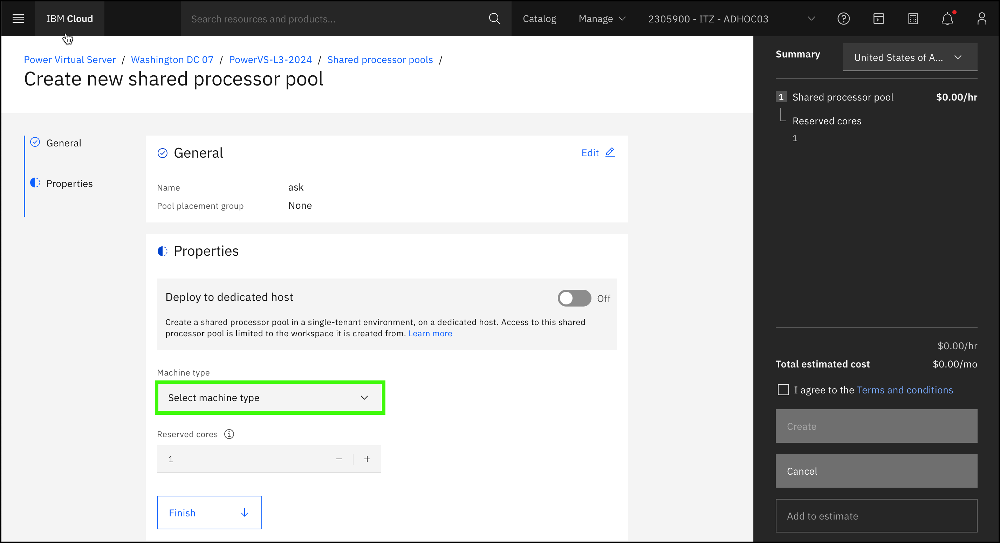
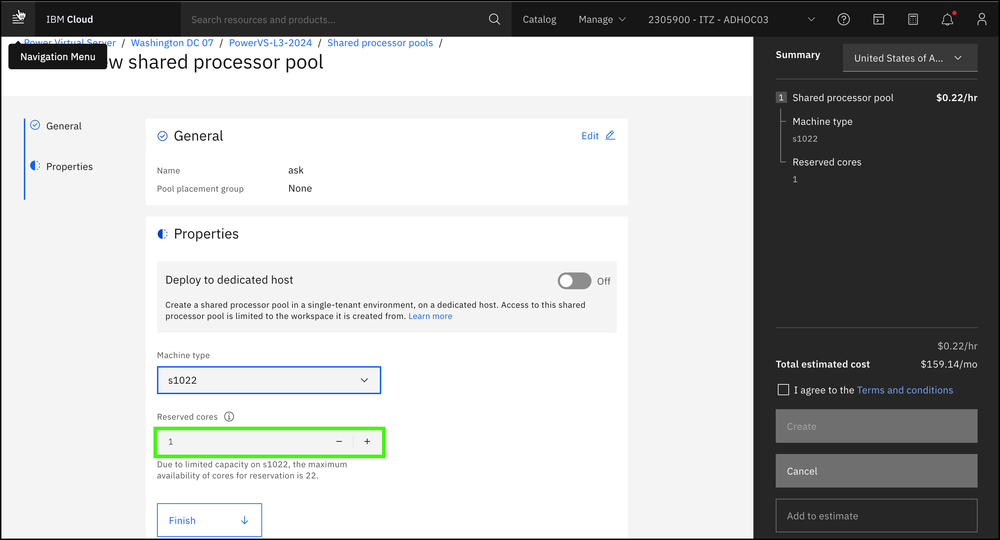
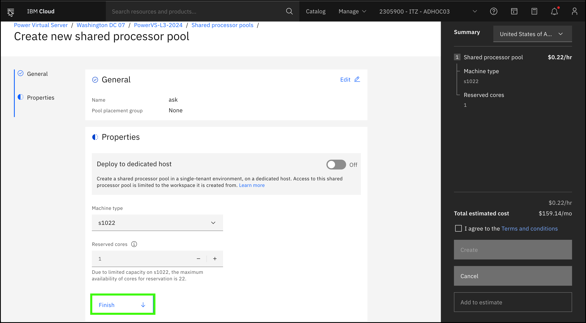
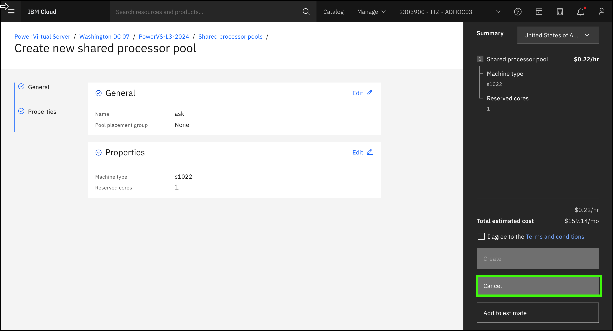
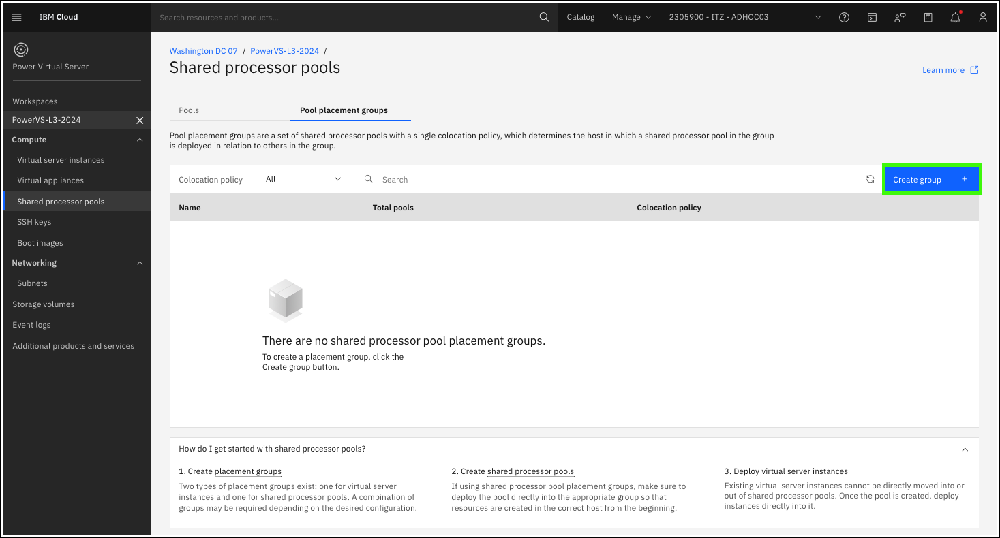
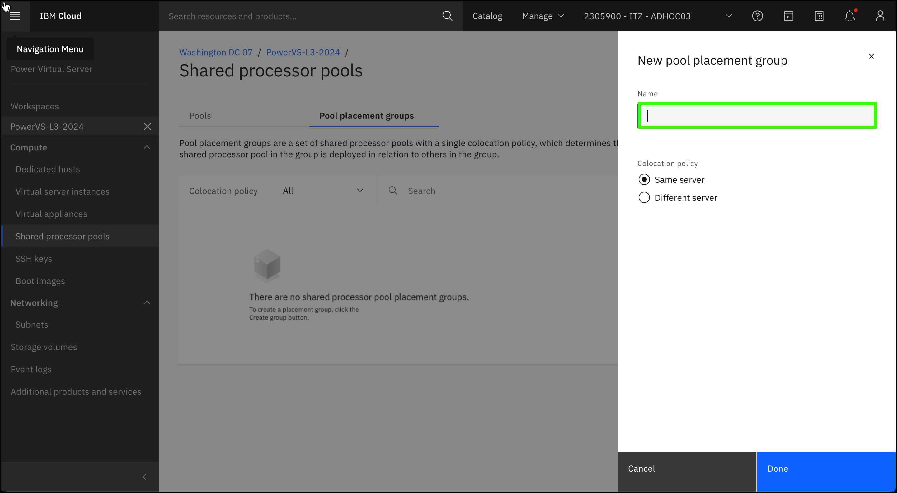
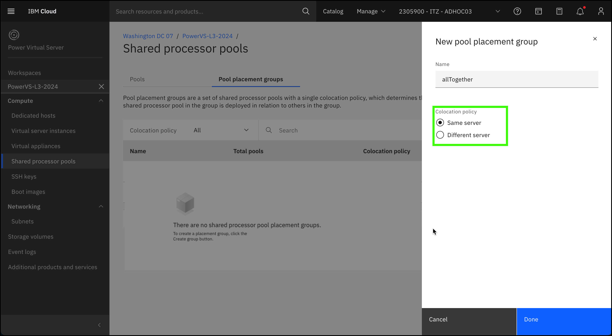
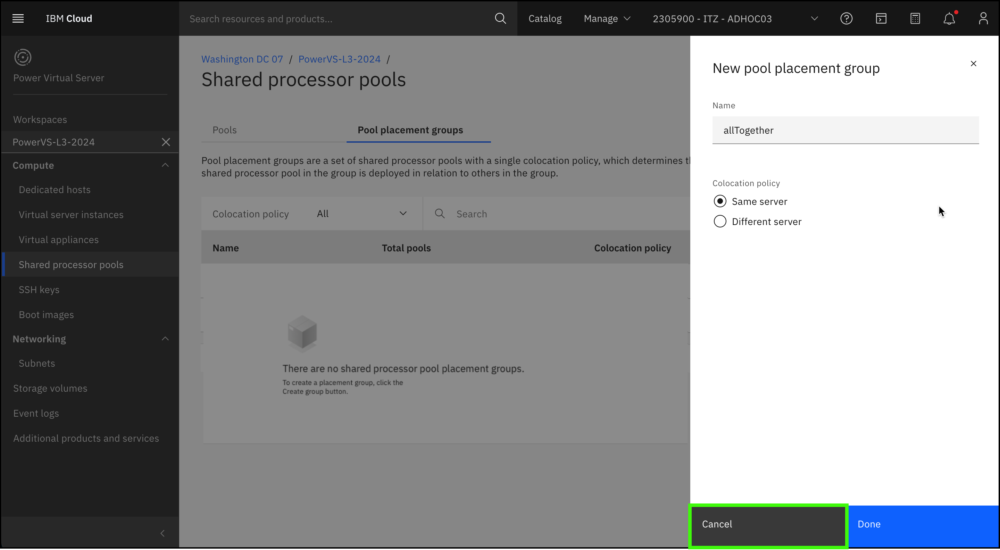

??? Important "Important information about the demonstration environment!"
    In this demonstration environment, full access to the IBM Cloud account is NOT provided. In the steps that follow, you will not have the ability to create, edit, or delete resources in the IBM Technology Zone environment.
    
A shared processor pool (SPP) is a pool of processor capacity that is shared between a group of virtual server instances. Unlike a virtual server instance that has a dedicated and defined maximum amount of processing capacity, you can set the reserved cores in SPP that is available at the pool level. SPPs are used to control software licensing costs by limiting the number of processors an uncapped VSI can use.

Learn more about SPPs <a href="https://cloud.ibm.com/docs/power-iaas?topic=power-iaas-manage-SPP" target="_blank">here</a>.

1. Click the **Shared processor pools** option in the side menu under the {{powerVS.serviceInstanceName}} workspace.

    

2. Click **Create pool +**

    

3. Enter a name in the **Name** field and then click **Continue**.

    

4. Select a **machine type**.

    

5. Specify the number of **reserved cores**.

    

6. Click **Finish**.

    
    
When actually provisioning an SPP, you would next accept the terms and conditions and create the SPP. After the SPP is provisioned, clients specify the SPP when a new VSI is created. 

7. Click **Cancel**.

    

8. Click the **Pool placement groups** tab.

    

    Pool placement groups are a set of shared processor pools with a single colocation policy. The policy determines the host in which an SPP in the group is deployed in relation to others in the group.

    Learn more about pool placement groups <a href="https://cloud.ibm.com/docs/power-iaas?topic=power-iaas-manage-SPP#configure-SPP-PG" target="_blank">here</a>.

9.  Click **Create group +**.

    

10. Enter a **Name** for the pool placement group.

    

11. Select the colocation policy of either **same server** or **different server**.

    The **same server** option specifies that all VSIs in this placement group are placed on the same server. This is known as an **affinity** policy.

    The **different server** option specifies that all VSIs in this placement group are placed on different servers. This is also known as an **anti-affinity** policy.

    

12. Click **Cancel**

    
    
Affinity and anti-affinity policies are used to help build high availability (HA) and disaster recovery (DR) deployments. Learn more about High Availability (HA) and Disaster Recovery (DR) options in PowerVS <a href="https://cloud.ibm.com/docs/power-iaas?topic=power-iaas-ha-dr" target="_blank">here</a>.