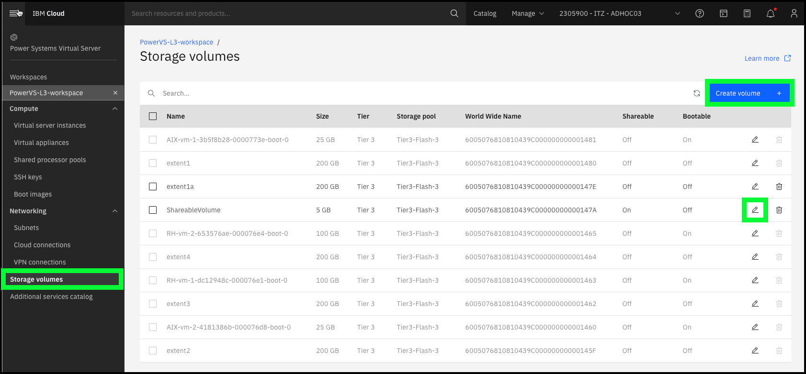
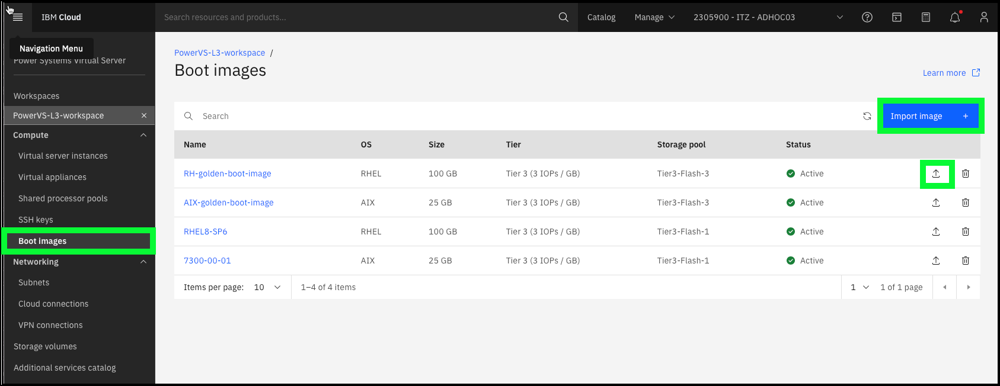

As mentioned earlier PowerVS supports both Tier 1 and Tier 3 storage volumes. Every instance consists of a boot volume and optionally additional storage volumes. While IBM manages the underlying physical storage, it is the client's responsibility to manage and protect the data on instances.

A few facts about storage volumes:

  - Storage volumes can be increased in size in 1GB increments, but not decreased.
  - Storage volume sizes maximums will depend on availability within the selected IBM datacenter.
  - Storage volumes can be marked as **shareable**.
  - Storage volumes can be marked as **bootable**.
  - Affinity and anti-affinity rules can be applied to storage volumes.

A few facts about boot volumes/images:

  - Boot volumes can be imported from IBM Cloud Object Storage (COS).
  - Boot volumes can be exported to IBM COS.
  - Affinity and anti-affinity rules can be applied to boot volumes.
  - Boot volumes (and storage volumes) of running instances can be captured (also know as a snapshot) to either the local image catalog associated with the PowerVS service or to IBM COS.
  - Captured boot images can be used to provision new instances.

In the TechZone environment:

  - Explore the **Storage volumes** page in the IBM Cloud Portal.
  
  - Explore the **Boot images** page in the IBM Cloud Portal.
  

Learn more about storage volumes <a href="https://cloud.ibm.com/docs/power-iaas?topic=power-iaas-modifying-server#modifying-volume-network" target="_blank">here</a>.

Learn how to import a boot image <a href="https://cloud.ibm.com/docs/power-iaas?topic=power-iaas-importing-boot-image" target="_blank">here</a>.
