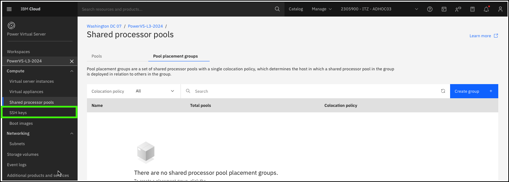
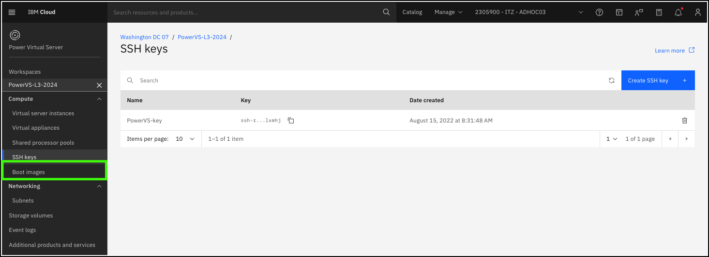
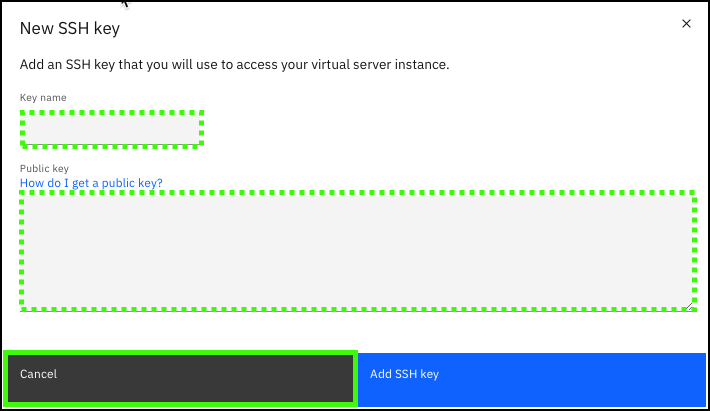

??? Important "Important information about the demonstration environment!"
    In this demonstration environment, full access to the IBM Cloud account is NOT provided. In the steps that follow, you will not have the ability to create, edit, or delete resources in the IBM Technology Zone environment.
    
Secure Shell also known as Secure Socket Shell (SSH) is a network protocol that is used to securely control access to computers over an unsecure network. 

Learn more about SSH <a href="https://en.wikipedia.org/wiki/Secure_Shell" target="_blank">here</a>.

Recall from the click through demonstrations to provision a virtual server instance, the {{powerVS.sshKey}} was specified as the SSH key for the server. The {{powerVS.sshKey}} was added to the workspace before those instances were created. 

!!! Note 

    It is unlikely you would demonstrate this aspect of the PowerVS offering during a client demonstration unless you had a very targeted and technical audience. It is add here to provide you a complete understanding of the offering and what is required to provision and manage a PowerVS environment.

1. Click the **Boot images** option in the side menu under the {{powerVS.serviceInstanceName}} workspace.

    

2. Click **Create SSH key**.

    

    The use of the term **Create** is a misnomer. This step loads the public part of an existing SSH key into the PowerVS workspace. The key can then be pushed to VSIs provisioned in the environment and used to access those VSIs.

    

    In the **New SSH key** dialog, the user specifies a name and then pastes the public key part of the SSH key previously created. The <a href="https://cloud.ibm.com/docs/power-iaas?topic=power-iaas-create-vm#ssh-setup" target="_blank">**How do I get a public key**</a> link provides information on how to generate a key on a Linux-based system.

3. Click **Cancel**.

After the key is loaded into the workspace, it appears in the list of available keys to use when a new PowerVS VSI is provisioned. It is the client's responsibility to securely manage their keys. If a key is compromised, a new key should be created and added to the existing VSIs. The old key should be removed from the VSIs and the PowerVS workspace.