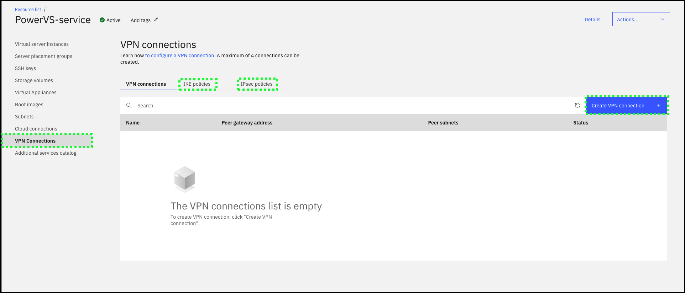

A few facts about subnets:
- A Classless inter-domain routing (CIDR) must be specified when creating a subnet.
- The first IP address in the CIDR is always reserved for the gateway in all data centers.
- The second and third IP addresses are reserved for gateway high availability (HA) in only the PowerVS colocation in the Washington, DC 04 datacenter (WDC04).

A few facts about Cloud connections:
  - Cloud Connect (Managed Networking Services using Megaport) is available only in USA.
  - A maximum of 2 connections can be created.
  - A subnet must be created prior to creating a Cloud connection.

A few facts about VPN connections:
  - A maximum of 4 connections can be created.
  - A subnet must be created prior to creating a Cloud connection.

In the TechZone environment,
  - Explore the **Subnets** page in the IBM Cloud Portal.
  
  - Explore the **Cloud connections** page in the IBM Cloud Portal.
  
  - Explore the **VPN connections** page in the IBM Cloud Portal.
  

Learn more about subnets <a href="https://cloud.ibm.com/docs/power-iaas?topic=power-iaas-configuring-subnet" target="_blank">here</a>.

Learn more about Cloud connections <a href="https://cloud.ibm.com/docs/power-iaas?topic=power-iaas-cloud-connections" target="_blank">here</a>.

Learn how to configure a VPN connection <a href="https://cloud.ibm.com/docs/power-iaas?topic=power-iaas-VPN-connections" target="_blank">here</a>.
