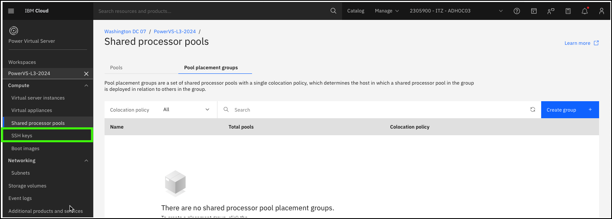
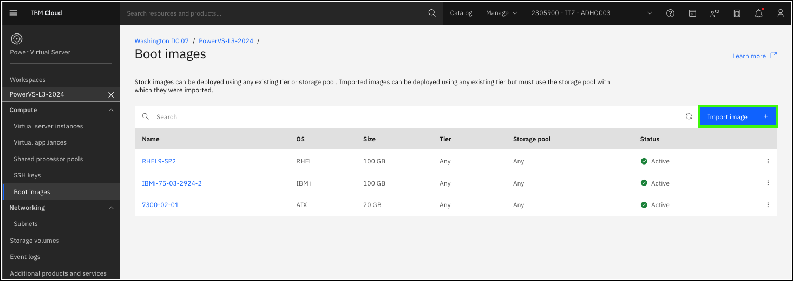
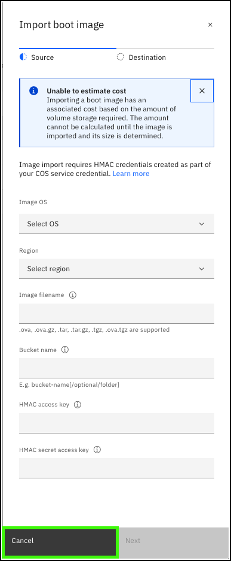
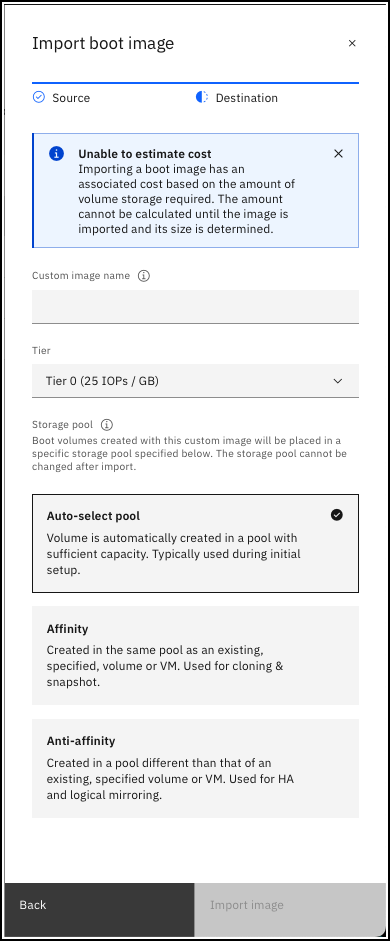

??? Important "Important information about the demonstration environment!"
    In this demonstration environment, full access to the IBM Cloud account is NOT provided. In the steps that follow, you will not have the ability to create, edit, or delete resources in the IBM Technology Zone environment.
    
Every instance of IBM Power Virtual Server (PowerVS) consists of a mandatory boot volume. Boot images come from the PowerVS image catalog or are imported by clients. After a virtual server instance (VSI) is provisioned, a copy of the boot image is added to the client's boot image catalog.

1. Click the **Boot images** option in the side menu under the {{powerVS.serviceInstanceName}} workspace.

    

    Notice the existing 3 boot images in the list.

    

    These 3 boot images map are used by the 3 VSIs running in this demonstration environment. The **Active** status means that the image is actively used by a running VSI.

2. Click **Import image +**.

    

    PowerVS allows clients to add their own boot images to their PowerVS workspace. Only AIX, IBM i, and Linux on IBM Power images are supported. To add an image to the PowerVS workspace image catalog, the image must first be uploaded to a bucket in IBM Cloud Object Storage (COS). Supported image file types include: .ova, .ova.gz, .tar, .tar.gz, and .tgz.

    

    To access the image in COS the file name, bucket name, hash-based message authentication code (HMAC) access key, and secret access keys must be specified. Learn more about COS <a href="https://cloud.ibm.com/objectstorage" target="_blank">here<a>. After these fields are specified and the user clicks **Next**, other parameters need to be provided for the boot image. 

    

    !!! Warning "You are not able to navigate to this screen."

    On the second **Import boot image** screen, the user is prompted to specify a name for the image, the storage tier for the image, storage pool. After those selections are made, the boot image is copied from COS to the PowerVS workspace's boot image catalog.

3. Click **Cancel**.

Learn more about importing boot images <a href="https://cloud.ibm.com/docs/power-iaas?topic=power-iaas-importing-boot-image" target="_blank">here</a>.