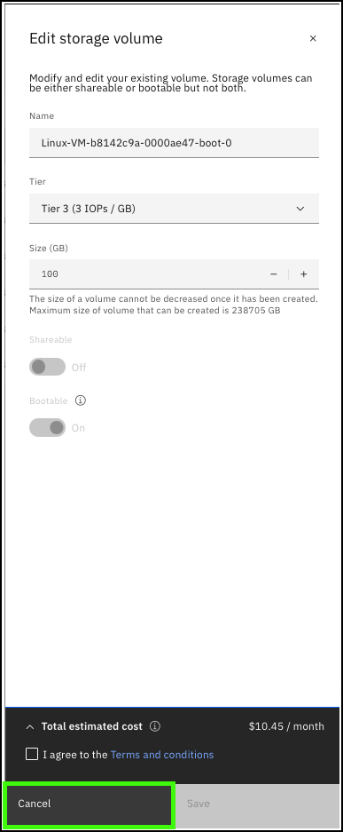

??? Important "Important information about the demonstration environment!"
    In this demonstration environment, full access to the IBM Cloud account is NOT provided. In the steps that follow, you will not have the ability to create, edit, or delete resources in the IBM Technology Zone environment.
    
As mentioned earlier IBM Power Virtual Server (PowerVS) supports multiple tiers of storage. Learn more about the available storage tiers <a href="https://cloud.ibm.com/docs/power-iaas?topic=power-iaas-about-power-iaas#storage-tiers-spec-private-cloud" target="_blank">here</a>. Every PowerVS virtual server instance consists of a boot volume and optionally other storage volumes. While IBM manages the underlying physical storage, it is the client's responsibility to manage and protect the data on instances.

1. Click the **Storage volumes** option in the side menu under the {{powerVS.serviceInstanceName}} workspace.

    

2. Click **Create volume +**.
    
    

3. Before continuing, review the parameters for creating a storage volume.

    To create a new storage volume, a few parameters must be specified. The first 4 parameters are the name of the volume, the storage tier, the number of volumes to create, and the size.

    a. Each storage volume in a workspace must have a unique name.

    b. A tier of storage must be specified. The storage tier can change later. The storage tier represents the performance characteristics of the volume and directly relates to the cost of the volume. See the earlier link for more information on the 4 storage tiers supported by PowerVS.

    c. It is possible to create up to 10 storage volumes at a time. Each of these volumes has the same attributes as far as tier, size, shareability, storage pool, and affinity rules.

    d. The size of a volume can range from 1 Gigabyte (GB) up to 238,705 GB. Storage volumes can be increased after they are provisioned but NOT decreased.

    

    The second set of parameters that need to be specified for a storage volume relates to the volumes shareability, storage pool, and affinity rules.

    e. Storage volumes can be marked as **shareable**. The **shareable** attribute allows a single volume to be shared between multiple PowerVS virtual server instances. The attribute is typically used in highly available (HA) deployments, for instance when PowerHA system mirroring capabilities are used. Learn more about HA and Diaster Recovery (DR) in PowerVS <a href="https://cloud.ibm.com/docs/power-iaas?topic=power-iaas-ha-dr" target="_blank">here</a>.

    f. A storage volume must be assigned to a storage pool. By default, the volume is assigned to any pool that has sufficient capacity. The volume can be controlled by affinity rules. The volume can be assigned to an affinity pool or an anti-affinity pool. Affinity can be based on either other storage volumes or upon virtual server instances (VSIs), also known as virtual machines (VMs). If a storage volume is marked with an affinity policy, it is created in the same pool as other volumes with which it needs to have affinity. An affinity policy is typically used for cloning and snapshots. If a storage volume is marked with an anti-affinity policy, it is created in a different pool from other volumes with which it needs anti-affinity. The anti-affinity policy is typically used for HA and logical mirroring of volumes.

    g. The affinity and anti-affinity object can be either another storage volume or a VSI.

    h. Depending on the affinity or anti-affinity object selection (g), the menu is populated with the existing volumes or VSIs that the policy is to be applied with or against.

    

4. Click **Cancel**.

    

    Learn more about affinity and anti-affinity policies <a href="https://cloud.ibm.com/docs/power-iaas?topic=power-iaas-powervs-faqs#affinity">here</a>.

5. Click **Edit** under the  for one of the existing storage volumes.

    

6. Before continuing, review the values for a storage volume that can be modified.

    As mentioned earlier, it is possible to modify some of the attributes of a storage volume.

    a. The name of the volume can be modified after it is provisioned. Remember, the name must be unique within the PowerVS workspace.

    b. The storage tier can be modified. However, if the volume is set to Fixed IOPs or is being changed to the Fixed IOPs tier, the size of the volume cannot be changed at the same time.

    c. The size of the volume can be increased from its current size up to the maximum of 238,705 GB. The size of the volume cannot be decreased.

    d. Non-bootable volumes can be toggled between shared and unshared.

    e. A volume can be marked as bootable. Bootable volumes cannot be shared. It is possible for a single VSI to have multiple bootable volumes. PowerVS randomly selects a bootable volume as the instance's boot volume if the original is no longer bootable. VSIs must have at least one bootable volume.

    

7. Click **Cancel**.

    

Storage volumes that are not actively in use by VSI can also be deleted from the edit menu. Learn more about managing storage volumes <a href="https://cloud.ibm.com/docs/power-iaas?topic=power-iaas-modifying-instance#modifying-volume-network" target="_blank">here</a>.