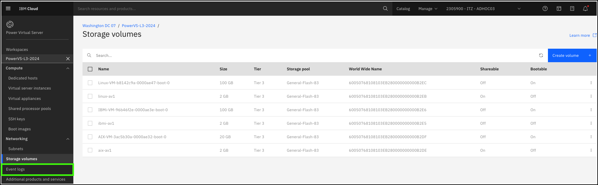
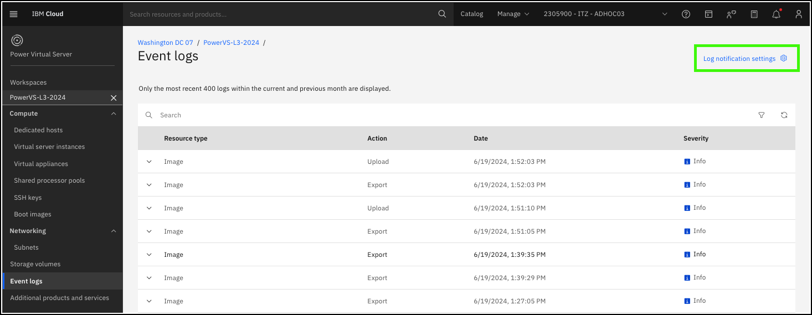
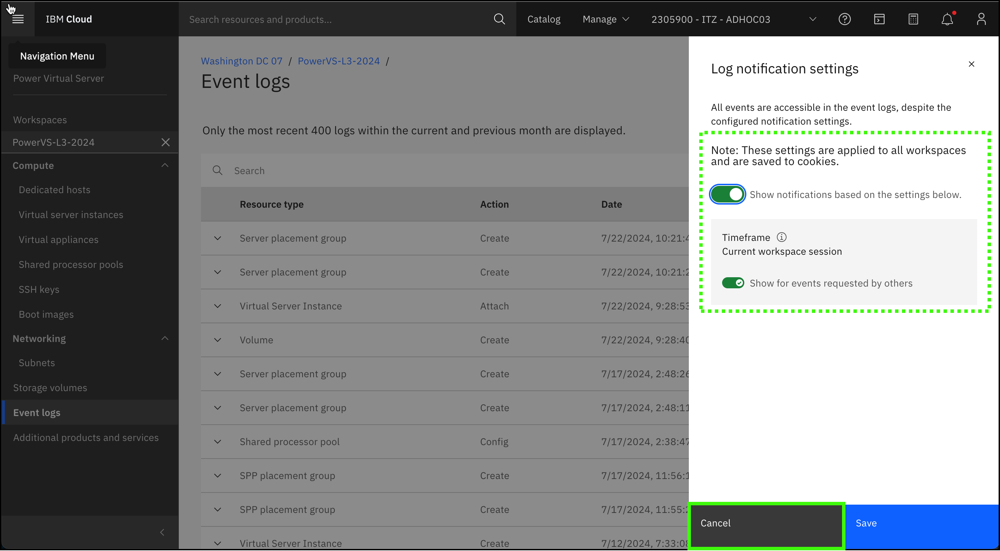
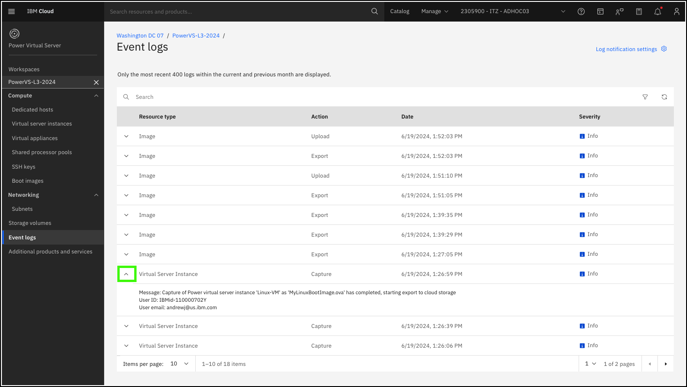
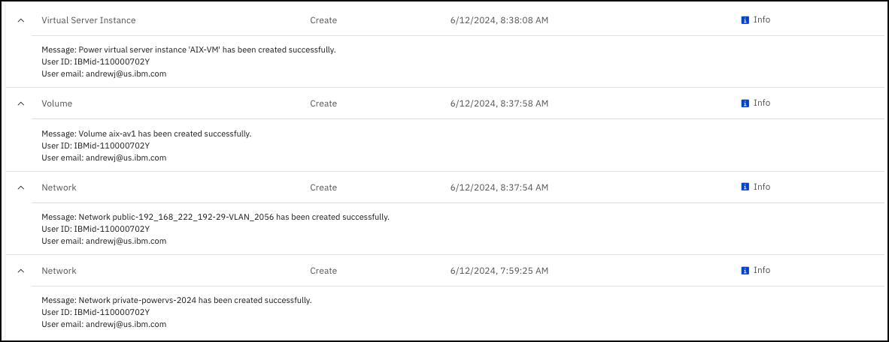

??? Important "Important information about the demonstration environment!"
    In this demonstration environment, full access to the IBM Cloud account is NOT provided. In the steps that follow, you will not have the ability to create, edit, or delete resources in the IBM Technology Zone environment.
    
The **Event logs** pages for PowerVS workspaces provides a view of the 400 most recent logs within the current and previous month. These logs show the recent activities, and provide details (like who performed the action) about the event. It is also possible to integrate PowerVS with IBM Cloud Monitoring and IBM Cloud Activity Tracker.

!!! Note "Deprecation of IBM Log Analysis and IBM Cloud Activity Tracker"

    IBM Log Analysis and IBM Cloud Activity Tracker are being replaced by IBM Cloud Logs in 2024. This demonstration guide will be updated to once IBM Cloud Logs in fully operational and integrated with PowerVS.

1. Click the **Event logs** option in the side menu under the {{powerVS.serviceInstanceName}} workspace.

    

2. Click **Log notification settings**.

    

3. Review the **Log notification settings** and then click **Cancel**.

    

    !!! Important "Don't see any notifications?"

        Since event logs only displays events in the current and previous month, it is possible that you may not see any events. If that is the case, you won't be able to follow the steps below; however, the images below will help you understand the type of information that is logged and to what level of detail.

4. Expand one of the events in the table.

    Note, if no events have been generated in last 60 days, there may not be an event to examine. This event is related to a **Virtual Server Instance** (VSI) resource type and was triggered when an image capture was run on one of the VSIs.

    

    The next image lists the events that were triggered when the first VSI in the demonstration environment was provisioned.

    

    The events that are logged are high-level events, but provide useful information as long-running tasks progress. For instance, provisioning the AIX VSI took about 40 minutes as documented by the timestamps.

For more detailed information, IBM Cloud Activity Tracker or IBM Cloud Logs can be used. Learn more about the options in **Part 8 - Observing PowerVS resources**.
