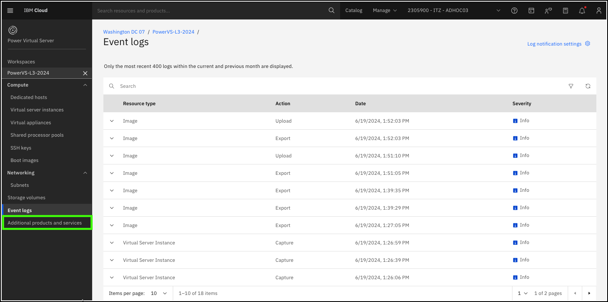
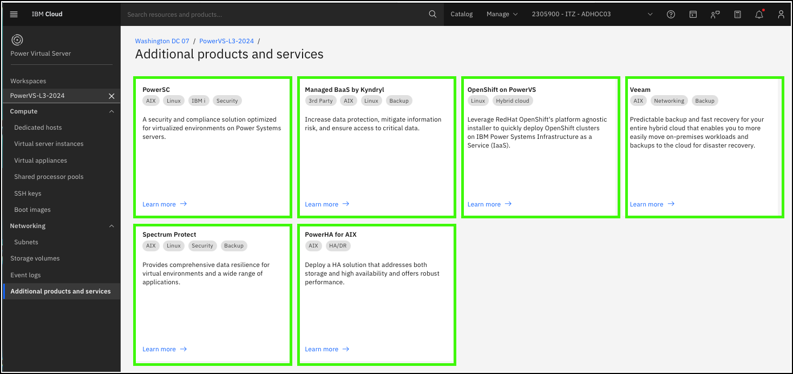

??? Important "Important information about the demonstration environment!"
    In this demonstration environment, full access to the IBM Cloud account is NOT provided. In the steps that follow, you will not have the ability to create, edit, or delete resources in the IBM Technology Zone environment.
    
Complimentary products and services are available for {{offering.name}} (PowerVS).

1. Click the **Additional products and services** option in the side menu under the {{powerVS.serviceInstanceName}} workspace.

    

    Each of the tiles that are listed represents  products and services that can be integrated with PowerVS. You are encouraged to click each of the tiles to learn about these products and services. 

    

Note, these products are not all the products and services available for PowerVS. Others are found by going to the <a href="https://cloud.ibm.com/catalog" target="_blank">IBM Cloud catalog</a> and search on **PowerVS** and **Power Virtual Server**. Unfortunately, due to naming differences and the embedded search engine, each search yields different results. Try both search strings to find other services and products that work with PowerVS.