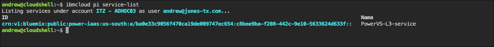
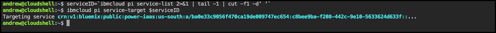
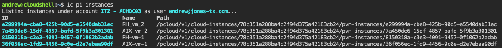
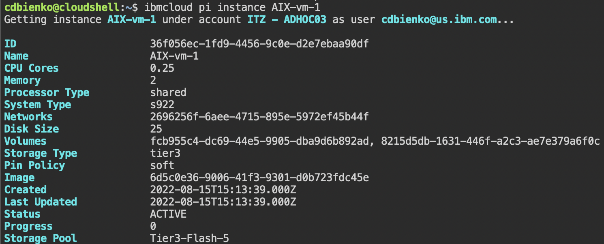
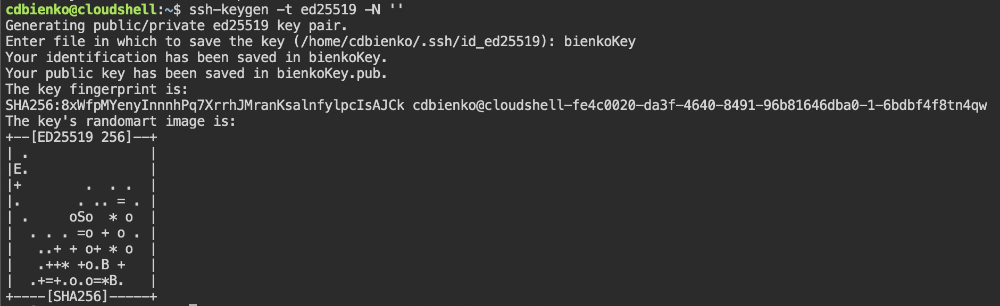
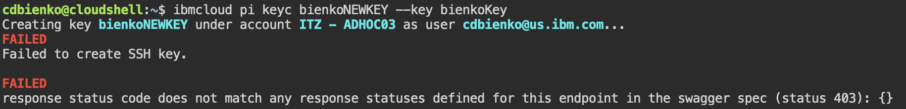
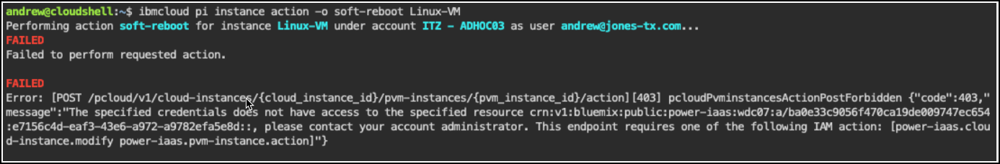

In this exercise, explore several of the PowerVS CLIs. It is important to remember this is a shared environment and only limited administrative permissions are provided. The CLIs being executed here are commands that only require "read" access to the environment. CLIs also exist to create and modify PowerVS resources, but in this shared environment users do not have sufficient permissions to execute those commands. Attempting to do so will result in an error.

For this exercise, the IBM Cloud Shell will be used. IBM Cloud Shell gives users complete control of their cloud resources, applications and infrastructure, from any web browser. IBM Cloud Shell provides pre-authenticated access to the latest tools and programming languages for cloud-based development, deployment and management of services and applications — all in a secure shell. IBM Cloud Shell is instantly accessible from the IBM Cloud portal. The IBM command line interface (CLI) along with all the IBM Cloud CLI plugins are pre-installed in IBM Cloud Shell, including the PowerVS CLIs.

It is also possible to install the IBM Cloud CLIs and PowerVS CLI plugin on other systems, like personal desktops, development servers, etc. To learn more about installing the PowerVS CLI locally click <a href="https://cloud.ibm.com/docs/power-iaas-cli-plugin?topic=power-iaas-cli-plugin-power-iaas-cli-reference" target="_blank">here</a>.

To get started, first open the IBM Cloud Shell from the IBM Cloud portal:

1. If not already opened, open the IBM Cloud Portal: <a href="https://cloud.ibm.com/" target="_blank">https://cloud.ibm.com/</a> and authenticate with your IBM Cloud credentials.
2. Change to the **{{account}}** account.


!!! tip
    If the browser window is narrow, this icon:  may be seen instead of the current account name as shown in the screen capture above.

3. Click the IBM Cloud Shell icon .


The next steps are performed in using the IBM Cloud Shell window that was opened.

First, create a SSH private key file using the key provided in the IBM Technology Zone's reservation welcome e-mail.

Remember, to avoid typographical errors **copy** the command line using the  icon when it is available. Then paste the contents into the IBM Cloud Shell using ++ctrl++**+v**, ++cmd++**+v**, or right click and select paste at the prompt in the IBM Cloud Shell.

4. Display all the PowerVS plugin command line options.

```
ibmcloud pi --help | more
```
??? tip "Tip for novice Linux users!"
    Those not familiar with Linux commands, don't worry. The above command is actually 2 commands. The first is ```ibmcloud pi --help```. This executes the **help** option of the PowerVS plugin. The second command is the ```more``` command which pauses the output being displayed. The **"|"** or **pipe** character takes the output from the first command and sends it as input to the second command. To learn more about Linux commands do an Internet search on **Linux primer**.

5. Press the **space bar** to continue the output. Continue to press space bar several times to scroll through the complete output.

Notice the last part of the message says: **Enter 'ibmcloud pi help [command]' for more information about a command.** Use this to get more help on individual PowerVS plugin commands.

6. List all the PowerVS services provisioned in the account.

```
ibmcloud pi service-list
```

!!! info "Sample output"
    

To view the PowerVS instances in the service, the service target must first be set for the PowerVS plugin.

7. Set the service target using the instance ID of the service.

```
serviceID=`ibmcloud pi service-list 2>&1 | tail -1 | cut -f1 -d' '`
```

??? tip "Tip for novice Linux users!"
    The last command did 4 actions. First, it listed the service list like in step 6 and redirected both the error and standard output to the standard output stream (**2>&1**). This output was then sent to the **tail** command which ignores everything but the last line (**-1**). Then the output from the **tail** command is sent to the **cut** command where all the output except the first field up to to the first space character is ignored (**-f -d' '**). And finally, the output from the **cut** command was stored in an environment variable called **serviceID**. Why did we do this? Because no one wants to type **crn:v1:bluemix:public:power-iaas:us-south:a/ba0e33c9056f470ca19de009747ec654:c8bee9ba-f208-442c-9e10-5633624d633f::** in order to run the next command.

8. Use the **$serviceID** environment variable to set the target of future PowerVS plugin commands to the service.

```
ibmcloud pi service-target $serviceID
```

!!! info "Sample output"
    

9. List all the PowerVS instances provisioned in the targeted PowerVS service.

```
ibmcloud pi instances
```

!!! info "Sample output"
    

10. View the details of the **{{aixServer1.name}}** instance.

```
ibmcloud pi instance {{aixServer1.name}}
```

!!! info "Sample output"
    

Thus far, all of these commands have been **read** commands. The PowerVS CLIs also support **create** and **update** commands, but remember that user IDs have limited access in this shared environment. Try the **instance modify** command and see what happens.

**Hint**: Business Partners should record the value of the **Storage Pool Affinity** field in the output from the above command.


11. Recall that our Power environment consists of a total of 4 PowerVM instances: AIX-vm-1, AIX-vm-2, RH-vm-1, and RH-vm2. Up until now we've primarily been issuing instructions to perform work against AIX-vm-1. Given that the testing environment is primarily limited to read-only actions, let's inspect one of the other VMs and determine what (if any) differences exist between the various instances.

Issue the following command to the IBM Cloud Shell:
```
ibmcloud pi instance RH-vm-1
```

And then issue a second command:
```
ibmcloud pi instance AIX-vm-1
```

Notice that the two tables are nearly identical, save for a single field at the bottom of the AIX-vm-1 inspection output.

12. There are numerous reasons why one might want to generate an SSH private key for managing a PowerVS environment. In fact, that's exactly what the service's administrators did in order to authorize access to the PowerVS instance — recall first connecting to the PowerVS virtual machines remotely via the IBM Cloud Shell with the supplied key information.

The IBM Cloud Shell is capable of generating an SSH key that is configured for password-less authentication (in other words, allowing users to authenticate without needing to also supply a password). This can be done using IBM Cloud Shell, or any Linux environment, using the following ssh-keygen command:

```
ssh-keygen -t ed25519 -N '' -f newKey
```

!!! info "Sample output"
    

Use the PowerVS CLIs to create a key for the instance using an imported RSA public key. Specify the key pair generated above as the source (newKey). Do so using the following command. (Note: newKeyPOWER is the name of the IBM Power CLI-generated key that is to be created; newKey is the SSH key generated earlier using the IBM Cloud Shell).

!!! tip "SSH keys"
    Be aware that the SSH key-pair generated and assigned by this step is specific to IBM Power Systems. These are distinct from ones generated previously using the IBM Cloud Shell.

```
ibmcloud pi keyc newKeyPOWER --key newKey
```

!!! info "Sample output"
    

As expected, the instruction fails to execute because of insufficient (locked down) permissions within this testing environment. Next, experiment with other IBM Power CLIs. Many instructions and commands will meet with similar results, but it nevertheless is good practice given that there is no risk to the system within this sandbox environment.


13. Restart the **{{rhServer1.name}}** instance.

```
ibmcloud pi instance-soft-reboot {{rhServer1.name}}
```

!!! info "Sample output"
    
    Note, an enhancement request has been submitted to improve the CLI error messages.

There are over 100 PowerVS CLIs. Feel free to explore these using the TechZone environment. Remember, use ```ibmcloud pi --help``` or ```ibmcloud pi <command> --help``` to get detailed information on a command's usage.

This concludes the final part of the {{offering.name}} demonstration script. Proceed to [**Part 8 - Next steps**](../Part 8/01 Next steps.md) for more information on completing the {{learningplan.name}} badge.
