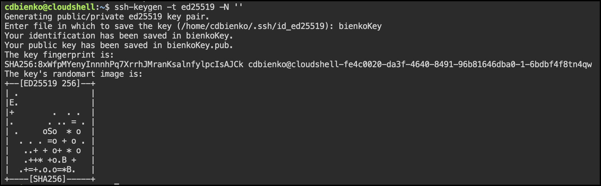

Now, explore several of the IBM Power Virtual Server (PowerVS) command-line interfaces (CLIs). 

For this exercise, the IBM Cloud Shell is used. IBM Cloud Shell gives users complete control of their cloud resources, applications, and infrastructure, from any web browser. IBM Cloud Shell provides pre-authenticated access to tools and programming languages for cloud-based development, deployment, and management of services and applications. IBM Cloud Shell is instantly accessible from the IBM Cloud portal. The IBM command-line interface (CLI) along with all the IBM Cloud CLI plug-ins are preinstalled in IBM Cloud Shell, including the PowerVS CLIs.

It is also possible to install the IBM Cloud CLIs and PowerVS CLI plug-in on other systems, like personal desktop and development servers. Learn more about installing the PowerVS CLI locally <a href="https://cloud.ibm.com/docs/power-iaas-cli-plugin" target="_blank">here</a>.

To get started, first open the IBM Cloud Shell from the IBM Cloud portal:

1. Open the IBM Cloud Portal: <a href="https://cloud.ibm.com/" target="_blank">https://cloud.ibm.com/</a> and authenticate with your IBM Cloud credentials.
2. Change to the **{{account}}** account.

    

    !!! tip

        If the browser window is narrow, this icon:  is seen instead of the current account name as shown in the preceding screen capture.

3. Click the IBM Cloud Shell icon .

    

The next steps are run in the IBM Cloud Shell window that was opened.

To avoid typographical errors **copy** the command line by using the  icon when it is available. Then paste the contents into the IBM Cloud Shell by using ++ctrl++**+v**, ++cmd++**+v** (may be operating system dependent), or right click and select paste at the prompt in the IBM Cloud Shell.

4. Display all the PowerVS plug-in command-line options.

    ```
    ibmcloud pi --help | more
    ```

    ??? tip "Tip for novice Linux users!"
        If you are not familiar with Linux commands, don't worry. The preceding command is two commands. The first is ```ibmcloud pi --help```. This command runs the **help** option of the PowerVS plug-in. The second command is ```more```. This command pauses the output being displayed. The **"|"** or **pipe** character takes the output from the first command and sends it as input to the second command. Search the internet for **Linux primer** to learn more about Linux commands.

5. Press the **space bar** to continue the output. Continue to press space bar several times to scroll through the complete output.

    Notice the last part of the message: **Enter 'ibmcloud pi [command] --help' for more information about a command.** Use this to get more help on individual PowerVS plug-in commands.

6. List all the PowerVS workspaces provisioned in the account.

    ```
    ibmcloud pi workspace ls
    ```

    !!! info "Sample output"
        

    To view the PowerVS instances in the workspace, the workspace target must first be set for the PowerVS plug-in.

7. Set the workspace target by using the instance ID of the workspace.

    ```
    workspaceID=`ibmcloud pi workspace ls 2>&1 | grep {{powerVS.serviceInstanceName}} | tail -1 | cut -f1 -d' '`
    ```

    ??? tip "Tip for novice Linux users!"
        The last command did 5 actions. First, it listed the workspace list like in step 6 and redirected both the error and standard output to the standard output stream (**2>&1**). Next, the output is filtered (grep) to show the line for the {{powerVS.serviceInstanceName}}. Then the output from the **grep** command is sent to the **cut** command where all the output except the first field up to the first space character is ignored (**-f -d' '**). Finally, the output from the **cut** command was stored in an environment variable called **workspaceID**. Why? Because no one wants to type **crn:v1:bluemix:public:power-iaas:wdc07:a/ba0e33c9056f470ca19de009747ec654:e7156c4d-eaf3-43e6-a972-a9782efa5e8d::** to run the next command.

8. Use the **$workspaceID** environment variable to set the target of future PowerVS plug-in commands to the workspace.

    ```
    ibmcloud pi workspace target $workspaceID
    ```

    !!! info "Sample output"
        

9. List all the PowerVS instances provisioned in the targeted PowerVS workspace.

    ```
    ibmcloud pi instance list
    ```

    !!! info "Sample output"
        

10. View the details of the **{{aixServer1.name}}** instance.

    ```
    ibmcloud pi instance get {{aixServer1.name}}
    ```

    !!! info "Sample output"
        

Thus far, all of these commands are **read** commands. The PowerVS CLIs also support **create** and **update** commands, but remember user IDs have access restrictions in this shared environment. Try the **instance update** command and see what happens.

11. Recall that the Power environment consists of three PowerVM instances: {{aixServer1.name}}, {{linuxServer1.name}}, and {{ibmiServer1.name}}. Up until now, commands were issued against {{aixServer1.name}}. Given that the testing environment is primarily limited to read-only actions, try inspect one of the other VMs and determine what (if any) differences exist between the various instances.

    Issue the following command to the IBM Cloud Shell:
    ```
    ibmcloud pi instance get {{linuxServer1.name}}
    ```

    And then issue a second command:
    ```
    ibmcloud pi instance get {{ibmiServer1.name}}
    ```

    Notice that the two tables are nearly identical, but differences do exist due to the operating systems used on each VSI.

12. There are numerous reasons why one might want to generate an SSH private key for managing a PowerVS environment. In fact, that's exactly what the service's administrators did to authorize your access to the PowerVS instances. Recall when first connecting to the PowerVS virtual machines remotely through the IBM Cloud Shell with the supplied key information.

    The IBM Cloud Shell can generate an SSH key that is configured for password-less authentication (in other words, allowing users to authenticate without needing to also supply a password). Using IBM Cloud Shell, or any Linux environment, run the following ssh-keygen command:

    ```
    ssh-keygen -t ed25519 -N '' -f newKey
    ```

    !!! info "Sample output"
        

    Use the PowerVS CLIs to create a key for the instance by using an imported RSA public key. Specify the key pair that was generated as the source (newKey). Do so by using the following command. (Note: newKeyPOWER is the name of the CLI-generated key that is to be created; newKey is the SSH key generated earlier by using the IBM Cloud Shell).

    !!! tip "SSH keys"
    
        The SSH key-pair generated and assigned by this step is specific to IBM Power Systems. These are distinct from ones generated previously by using the IBM Cloud Shell.

    ```
    ibmcloud pi ssh-key create newKeyPOWER --key newKey
    ```

    !!! info "Sample output"
        

    As expected, the instruction fails to run because of insufficient (locked down) permissions within this demonstration environment. Next, experiment with other IBM Power CLIs. 

13.  Restart the **{{linuxServer1.name}}** instance.

    ```
    ibmcloud pi instance action -o soft-reboot {{linuxServer1.name}}
    ```

    !!! info "Sample output"
        

There are over 100 PowerVS CLIs. Explore more CLIs by using the ITZ environment. Remember, use ```ibmcloud pi --help``` or ```ibmcloud pi <command> --help``` to get detailed information on a command's usage.

