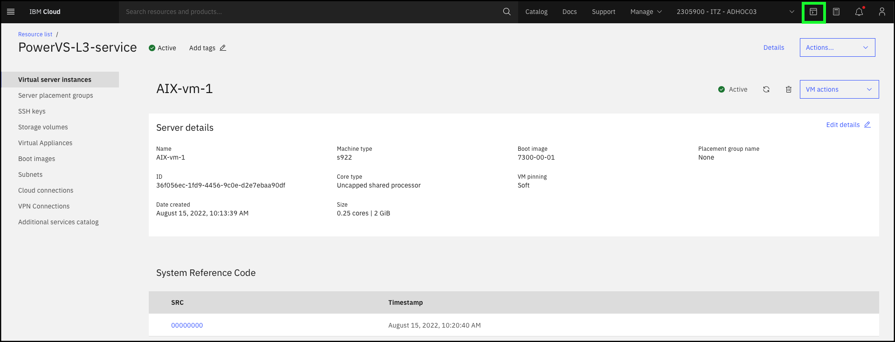

In this exercise, explore several of the PowerVS CLIs. It is important to remember you are using a shared environment and have limited administrative permissions. The CLIs being executed here are command that only require "read" access to the environment. CLIs also exist to create and modify the PowerVS resources, you will just not have sufficient permissions to execute those commands in the shared environment. Attempting to do so will result in an error.

For this exercise, the IBM Cloud Shell will be used. IBM Cloud Shell gives users complete control of their cloud resources, applications and infrastructure, from any web browser. IBM Cloud Shell provides pre-authenticated access to the latest tools and programming languages for cloud-based development, deployment and management of services and applications — all in a secure shell. IBM Cloud Shell is instantly accessible from the IBM Cloud portal. The IBM command line interface (CLI) along with all the IBM Cloud CLI plugins are pre-installed in IBM Cloud Shell, including the PowerVS CLIs.

It is also possible to install the IBM Cloud CLIs and PowerVS CLI plugin other systems, like personal desktops, development servers, etc. To learn more about installing the PowerVS CLI locally click <a href="https://cloud.ibm.com/docs/power-iaas-cli-plugin?topic=power-iaas-cli-plugin-power-iaas-cli-reference" target="_blank">here</a>.

To get started, first open the IBM Cloud Shell from the IBM Cloud portal:

1. If not already opened, open the IBM Cloud Portal: <a href="https://cloud.ibm.com/" target="_blank">https://cloud.ibm.com/</a> and authenticate with your IBM Cloud credentials.
2. Change from your IBM Cloud account to the **{{account}}** account.


!!! tip
    If your browser window is narrow, you may see this icon:  instead of the current account name as shown in the screen capture above.

3. Click the IBM Cloud Shell icon .



The next steps are performed in using the IBM Cloud Shell window that was opened. First, you need to create a SSH private key file using the key provided in your IBM Technology Zone's reservation welcome e-mail.

Remember, to avoid typographical errors **copy** the command line using the  icon when it is available. Then paste the contents into the IBM Cloud Shell using ++ctrl++**+v**, ++cmd++**+v**, or right click and select paste at the prompt in the IBM Cloud Shell.

4. Display all the PowerVS plugin command line options.

```
ibmcloud pi --help | more
```
??? tip "Tip for novice Linux users!"
    If you are not familiar with Linux commands, don't worry. The command you just ran is actually 2 commands. The first is ```ibmcloud pi --help```. This executes the **help** option of the PowerVS plugin. The second command is the ```more``` command which pauses the output being displayed.  The **"|"** or **pipe** character takes the output from the first command and sends it as input to the second command. If you want to learn more about Linux commands, just do a Internet search on **Linux primer**.

5. Press the **space bar** to continue the output.

Notice the last part of the message says: **Enter 'ibmcloud pi help [command]' for more information about a command.**. Use this to get more help on individual PowerVS plugin commands.

6. List all the PowerVS services provisioned in the account.

```
ibmcloud pi service-List
```

!!! info "Sample output"
    andrew@cloudshell:~$ ibmcloud pi service-list
    ID                                                                                                                    Name
    crn:v1:bluemix:public:power-iaas:us-south:a/ba0e33c9056f470ca19de009747ec654:c8bee9ba-f208-442c-9e10-5633624d633f::   PowerVS-L3-service

To view the PowerVS instances in the service, the service target must first be set for the PowerVS plugin.

7. Set the service target using the instance ID of the service.

```
serviceID=`ibmcloud pi service-list 2>&1 | tail -1 | cut -f1 -d' '`
```

??? tip "Tip for novice Linux users!"
    The last command did 4 actions. First, it listed the service list just like in step 6, and redirected both the error and regular output to the regular output stream (**2>&1**). This output was then sent to the **tail** command which ignores everything but the last line (**-1**). Then the output from the **tail** command is sent to the **cut** command where all the output except the first field upto to the first space character is ignored (**-f -d' '**). And finally, the output from the **cut** command was stored in an environment variable called **serviceID**. Why did we do this? Because no one wants to type **crn:v1:bluemix:public:power-iaas:us-south:a/ba0e33c9056f470ca19de009747ec654:c8bee9ba-f208-442c-9e10-5633624d633f::** in order to run the next command.

8. Use the **$serviceID** environment variable to set the target of future PowerVS plugin commands to the service.

```
ibmcloud pi service-target $serviceID
```

!!! info "Sample output"
    andrew@cloudshell:~$ ibmcloud pi service-target $serviceID
    Targeting service crn:v1:bluemix:public:power-iaas:us-south:a/ba0e33c9056f470ca19de009747ec654:c8bee9ba-f208-442c-9e10-5633624d633f::...

9. List all the PowerVS instances provisioned in the targeted PowerVS service.

```
ibmcloud pi instances
```

!!! info "Sample output"
    andrew@cloudshell:~$ ibmcloud pi instances
    Listing instances under account ITZ - ADHOC03 as user andrew@jones-tx.com...
    ID                                     Name       Path
    e299994a-cbe8-425b-90d5-e5540dab31ec   RH_vm_2    /pcloud/v1/cloud-instances/78c351a288ba4c2f94d375a42183cb24/pvm-instances/e299994a-cbe8-425b-90d5-e5540dab31ec
    7a450de6-15df-4857-bafd-5f9b3a301301   AIX-vm-2   /pcloud/v1/cloud-instances/78c351a288ba4c2f94d375a42183cb24/pvm-instances/7a450de6-15df-4857-bafd-5f9b3a301301
    8150318a-c3e3-4091-9457-0f1062b2adab   RH-vm-1    /pcloud/v1/cloud-instances/78c351a288ba4c2f94d375a42183cb24/pvm-instances/8150318a-c3e3-4091-9457-0f1062b2adab
    36f056ec-1fd9-4456-9c0e-d2e7ebaa90df   AIX-vm-1   /pcloud/v1/cloud-instances/78c351a288ba4c2f94d375a42183cb24/pvm-instances/36f056ec-1fd9-4456-9c0e-d2e7ebaa90df

10. View the details of the **{{aixServer1.name}}** instance.

```
ibmcloud pi instance {{aixServer1.name}}
```

!!! info "Sample output"
    
