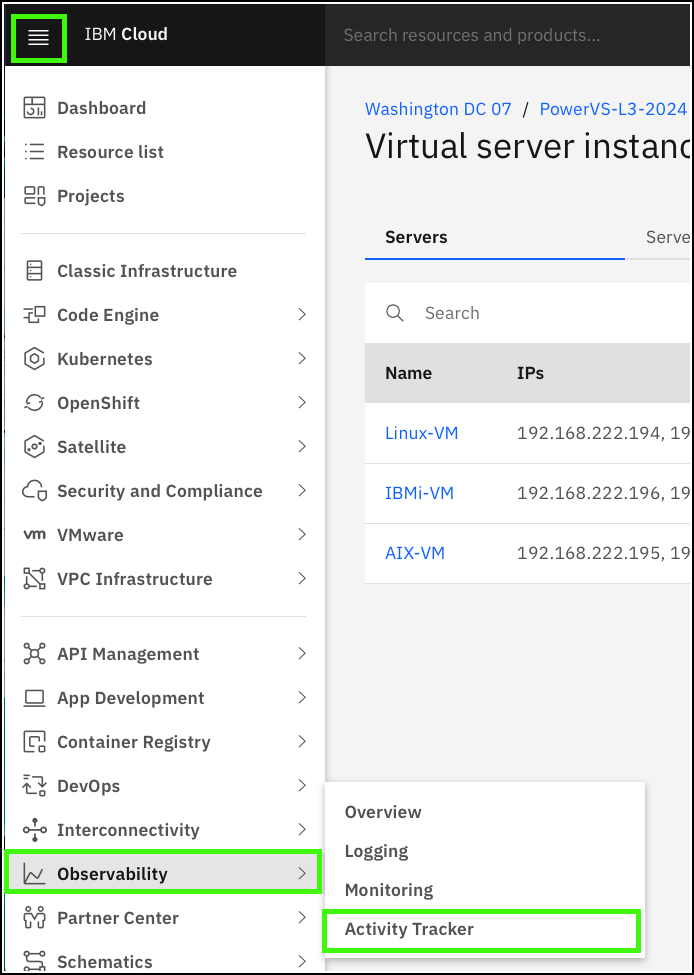
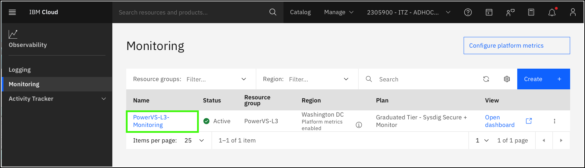
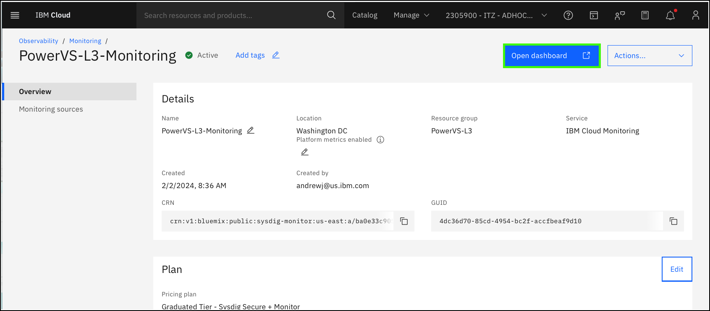
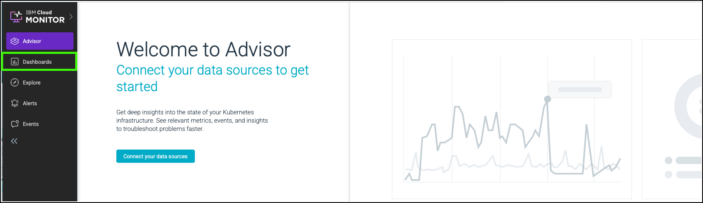
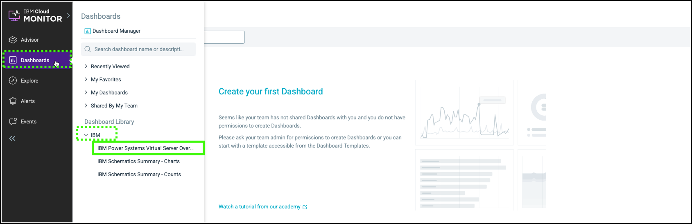
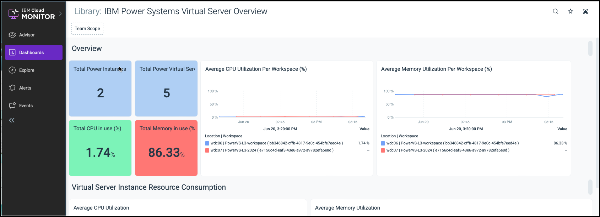
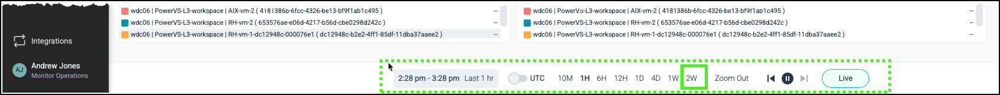

IBM Cloud Monitoring offers visibility into the performance and health of cloud-based infrastructure and applications, with in-depth troubleshooting and alerting. Learn more about IBM Cloud Monitoring <a href="https://cloud.ibm.com/docs/monitoring?topic=monitoring-getting-started" target="_blank">here</a>.

For this demonstration guide, an IBM Cloud Monitoring instance is already provisioned. This instance monitors the resources that are part of the PowerVS-L3 resource group in the shared cloud account. Your user ID has permission to open and view the IBM Cloud Monitoring dashboard. 

In the steps that follow, learn how to:

- access the IBM Cloud Monitoring instance by using the IBM Cloud portal
- open the IBM Cloud Monitoring dashboard
- view the standard PowerVS dashboard that shows the performance and health of the PowerVS resources

Note, this demonstrate guide does not provide detailed information on provisioning, configuring, and customizing IBM Cloud Monitoring. Nor does it provide details on the meaning of individual performance metrics that are reported.

1. Click the IBM Cloud portal menu , expand the **Observability** menu and click **Monitoring**.

    

2. Click {{powerVS.monitoringInstance}}.

    

    Explore the settings for this monitoring instance.

3. Click **Open dashboard**.

    

    The IBM Monitoring dashboard opens in a new browser tab or window. You may be asked to reauthenticate to IBM Cloud when the new window is opened.

4. Click **Dashboards** in the side menu.

    

5. Click **IBM Power Systems Virtual Server Overview** dashboard under the **IBM** section.

    

    !!! Note "Your view looks different?"

        The images that follow were captured when both the new and old PowerVS workspaces existed for this learning plan. Your view will likely only show a single Power Instance and three Power Virtual Server instances.

    

    Notice that the bottom of the dashboard provides controls to adjust the time frame for the charts presented on the dashboard. The default is set to one hour (1H). To see more data and make the charts appear more interesting, consider changing the time setting to two weeks (2W).

    

    Now, explore the various charts (also known as panels) that make up the default PowerVS overview dashboard. Understand that IBM Cloud Monitoring has many more capabilities like the ability to customize dashboards, create new dashboards and panels, monitor for specific events, and send alerts when events occur.

Refer to the link provided earlier to learn more about all the capabilities of IBM Cloud Monitoring.

