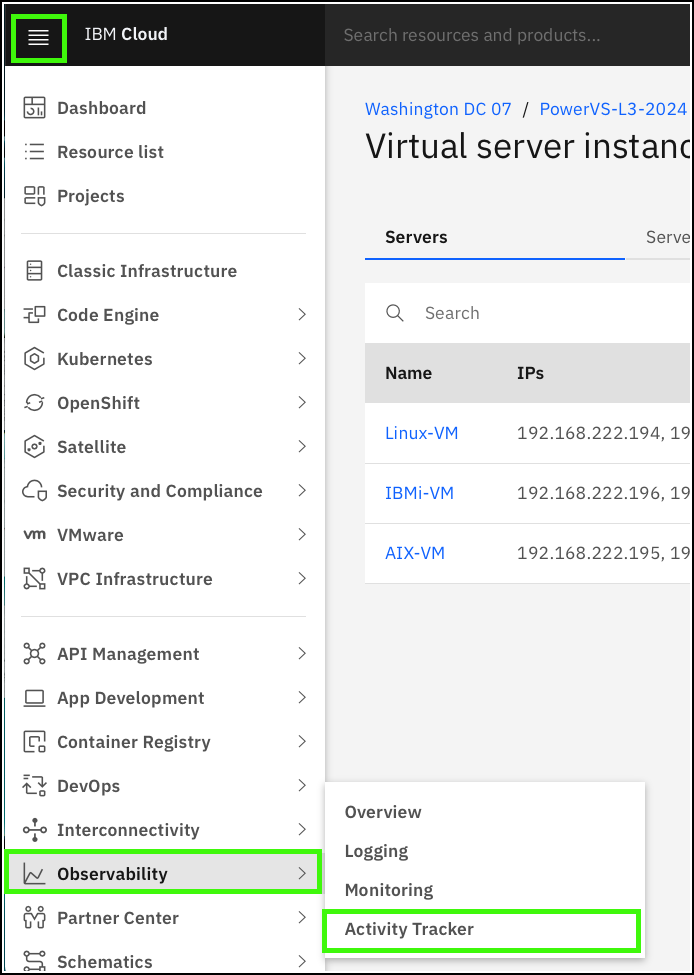

IBM Cloud Activity Tracker is used to record your IBM Cloud activities and monitor the activity of your IBM Cloud account. This service can be used to investigate abnormal activity and critical actions, and comply with regulatory audit requirements. It can also send an alert when specific activities occur.

!!! Important "IBM Cloud Activity Tracker is deprecated."

   IBM Cloud Activity Tracker will be discontinued on 30 March 2025 and replaced by IBM Cloud Logs. A migration tool will be provided to assist with client transitions to the new service. When IBM Cloud Logs is fully operational, this demonstration guide will be updated.

For this demonstration guide, an IBM Cloud Activity Tracker instance is already provisioned. This instance tracks activities for the resources that are part of the PowerVS-L3 resource group in the shared cloud account. Your user ID has permission to open and view the IBM Cloud Activity Tracker dashboard. 

In the steps that follow, learn how to:

- access the IBM Cloud Activity Tracker instance by using the IBM Cloud portal
- open the IBM Cloud Activity Tracker dashboard
- explore activities that are related to the PowerVS resources in this environment

Note, this demonstrate guide does not provide detailed information on provisioning, configuring, and customizing IBM Cloud Activity Tracker, nor does it provide details on the meaning of individual activities.

1. Click the IBM Cloud portal menu , expand the **Observability** menu and click **Activity Tracker**.

    

2. Click {{powerVS.atInstance}}.

    

    Explore the settings for this monitoring instance.

3. Click **Open dashboard**.

    

    The IBM Activity Tracker dashboard opens in a new browser tab or window. You may be asked to reauthenticate to IBM Cloud when the new window is opened.

    !!! Note "Your view looks different?"

        The images below were captured at a point in time. Activity Tracker provides a live view of events and displays the most recent events at the bottom of the page.

4. Adjust the **Timeline** on the right to narrow or expand the events that are viewed.

      

4. Expand an event.

    To expand an event, hover the mouse to the left of an event and click the down arrow when it appears for the event. 

    This view provides details about the selected event. This includes information like what the event was (action), who initiated it, and the outcome of the event.

    Explore a few of the different events that exist.

    

5. Click the **Sources** pull-down, select **power-iaas**, and click **Apply**.

    IBM Activity Tracker can filter on specific events, specific time frames, and other attributes.

    

    This filter narrows the events in the current view to those related to the PowerVS infrastructure resources.

    Activity Tracker can also filter based on the **Level** of the event. For example, informational, debug, warning, errors, and critical events. 

To see the most recent events, click **Live** at the lower right of the dashboard. Take a few minutes exploring some of the recent activities that have been logged. Learn more about IBM Cloud Activity Tracker <a href="https://cloud.ibm.com/docs/activity-tracker?topic=activity-tracker-about" target="_blank">here</a>.