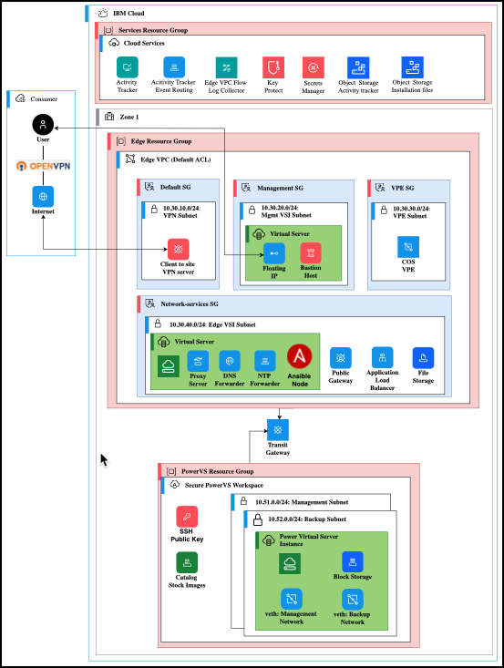

A deployable architecture is cloud automation for deploying a common architectural pattern that combines one or more cloud resources. It is designed to provide simplified deployment by users, scalability, and modularity. A deployable architecture incorporates one or more modules. Deployable architectures are coded in Terraform, which you configure with input variables to achieve a wanted behavior. Learn more about deployable architectures <a href="https://cloud.ibm.com/docs/secure-enterprise?topic=secure-enterprise-understand-module-da" target="_blank">here</a>.

As of April 2025, IBM Power Virtual Server (PowerVS) has 2 deployable architectures in the IBM Cloud Catalog.

- **Power Virtual Server with VPC landing zone**
    
    Provisioning Power Virtual Server with Virtual Private Cloud (VPC) landing zone by using deployable architectures provides an automated deployment method to create an isolated PowerVS workspace and connect it with IBM Cloud services and public internet. Network management components like DNS, NTP, proxy servers, and NFS as a Service might be installed. Comparing the provisioning through the projects UI, user interaction is minimized and ready-to-go deployment time of a PowerVS workspace is reduced from days to less than 1 hour. Learn more about this deployable architecture <a href="https://cloud.ibm.com/docs/powervs-vpc?topic=powervs-vpc-automation-solution-overview" target="_blank">here</a>.

- **Power Virtual Server for SAP HANA**

    SAP solution provisioning on PowerVS using deployable architectures provides an automated deployment method to create a PowerVS landscape with SAP HANA systems. User interaction is minimized and SAP system deployment time is reduced from weeks to days. This deployable architecture is a composition or **stack** of this deployable architecture and the Power Virtual Server with VPC. Learn more about this deployable architecture <a href="https://cloud.ibm.com/docs/sap-powervs?topic=sap-powervs-automation-solution-overview" target="_blank">here</a>.

The click through demonstration that follows steps through the provisioning of the **Power Virtual Server with VPC landing zone** deployable architecture. A brief tour of the environment is also provided in the click through demonstration. The deployed solution is available in the IBM Technology Zone environment that is associated with this demonstration guide. You have view-only access to the PowerVS workspace and the associated virtual private cloud (VPC). 

Several prerequisite steps were completed before provisioning the deployable architecture. These include creating an IBM Cloud application programming key (API) and an IBM Cloud Secrets Manager instance. The API key was also added to the secrets manager instance. In addition, an SSH public and private key pair was created to enable access to the VSI create by the deployable architecture.

Use the click through demonstration to experience provisioning a deployable architecture for PowerVS.

Note, fields that require a text entry (for example workspace name) are pre-populated in the click through demonstration.

!!! tip
    Not sure where to click or what to do next? Click anywhere on the screen and the next spot to click is highlighted.

1. Open the following link and then click play  to begin the demonstration.

    **Click through demo:** <a href="https://ibm.github.io/SalesEnablement-PowerVS-L3/includes/Provisioning-a-DeployableArchitecture/index.html" target ="_blank">Provision the **Power Virtual Server with VPC landing zone**  Deployable Architecture</a>

2. Click **Catalog**.
3. Select **Deployable architectures** under **Type**.
4. Click the ****Power Virtual Server with VPC landing zone** tile.
5. Click **See more**.
6. Click **See less**.

    The Power Virtual Server with VPC landing zone as 'Quickstart' variation of 'Create a new architecture' option deploys VPC services and a Power Virtual Server workspace and interconnects them. It also creates one Power virtual server instance of chosen t-shirt size or custom configuration.

    

7. Click **Add to project**.
8. Click the **Name** field.

    IBM Cloud projects are a named collection of configurations that are used to manage related resources and deployments across accounts, embracing an Infrastructure as Code (IaC) approach to deployments. They enable teams to configure, deploy, and monitor deployments by using DevOps best practices. Each project includes tools to scan for potentially harmful resource changes, compliance, security, and cost, tracking configuration versioning, and governance. They are designed with an IaC and a compliance-first approach that helps to ensure that a project is managed, secure, and always compliant. Learn more <a href="https://cloud.ibm.com/docs/secure-enterprise?topic=secure-enterprise-understanding-projects" target="_blank">here</a>.

9. Click the **Description** field.
10. Click the **Region** drop-down.

    Note, the availability of deployable architectures vary by data center based on resource availability. 

11. Click **Dallas**.
12. Click the **Resource group** drop-down.
13. Click **Create**.

The next steps specify required configuration parameters for deploying the resources that are defined by the deployable architecture. In addition to the security and other required parameters, optional parameters can be specified. All these parameters are saved with the project and can be used to consistently deploy the same configuration and to manage drift of deployments.

14. Click the **method** drop-down in the Authentication section.

    Both **Trusted profiles** and **Secrets Manager** are supported for providing authentication credentials.

15. Click **API key using Secrets Manager**.
16. Click the  key icon.

Note, the recording did not capture properly here. In short, the previously uploaded API key was selected from the secrets manager instance.

17. Click the **Required** tab.
18. Click the **powervs_zone** drop-down.
19. Click **Dallas (dallas)**.
20. Click the **prefix** field.

    The prefix is used in naming resources created during the automation for the deployable architecture.

21. Click the **tshirt-size** field.

    Recall with this deployable architecture, a PowerVS VSI is provisioned. The configuration of the VSI needs to be specified. In addition, although not shown in this click through, the operating system image for the VSI can be specified in the optional parameters.

22. Click **AIX-XS**.
23. Click the  pencil icon under **ssh_public_key**.
24. Click the **Edit secure value** field.

    As mentioned earlier, an SSH public and private key pair must be created before starting the deployable architecture. This key pair might also be stored and retrieved from the secrets manager instance.

25. Click **OK**.
26. Click the  pencil icon under **ssh_private_key**.
27. Click the **Edit secure value** field.
28. Click **OK**
29. Click the **powervs_resource_group_name** drop-down.
30. Click **PowerVS-L3**
    
    Note the **external_access-ip** addressed specifies the IP address that can be used to access the PowerVS address. A specific route entry is created in the associated VPC network to allow this connection.

31. Click **Save**
32. Click **Validate**.

    This step validates the configuration and parameters that were set. The scan looks for code errors, compliance, issues, and calculates the cost of the deployment. The scan took about 15 minutes to complete.

33. Click the **Add a comment** field.
34. Click **Approve**.
35. Click **Deploy**.
    
    The actual deployment of the architecture takes about 30 minutes to complete. While this is processing, examine the underlying activities.

36. Click the  plus icon to open a new tab to the IBM Cloud portal.
37. Click the  hamburger menu.
38. Click **Projects**.
39. Click **da-pvs-l3**.
40. Click the **Configurations** tab.

    Notice the deployment status of the configuration.

41. Click the  hamburger menu.
42. Click **Workspaces** in the **Schematics** menu.
43. Click **deploy-arch-ibm-pvs-inf-c0aa**.
44. Click **Expand**.

    The log entries that are shown are all the steps that are processed as part of the deployable architecture. You don't need to read them. Understand the automation is creating and validating all the resources that are defined by the deployable architecture. Including the VPC and associated networks, the VSIs in the VPC, and the PowerVS VSI.

45. Click the **deploy-arch-ibm-pvs-inf-c0as** browser tab.

    Notice the information and options presented. The deployment succeeded. It took 29 minutes to complete.

46.  Click the **x** to close the dialog.

!!! Important 

    The next steps are specific to the click through demonstration, but they can also be used with an active IBM Technology Zone (ITZ) reservation associated with this demonstration guide. You can proceed with the click through demonstration or switch to the IBM Cloud portal. Make sure you are using the **2305900 - ITZ - ADHOCO3** account.

47. Click the  hamburger menu.
48. Click **Resource list**.
49. Click the **da-pvs-l3-us-south-power-workspace** entry under **Compute**.
    
    Notice that the workspace name has the prefix that was specified during the configuration steps of the deployable architecture. Also, the extra small AIX VSI has been provisioned and is active.

50. Click **Subnets**.

    Notice, like shown in the architecture diagram of the deployable architecture, two subnets are created for the workspace. One for a management network and one for a backup network.

51. Click the  hamburger menu.
52. Click **VPC Infrastructure**.
53. Click **VPC layout**.

In the next steps, examine the resources that are associated with each subnet.

54. Click **da-pvs-l3-edge-vsi-edge-zone-1**.
55. Click **da-pvs-l3-edge-vpn-zone-1**.
56. Click **da-pvs-l3-edge-vsi-management-zone-1**.
57. Click **da-pvs-l3-edge-vpe-zone-1**.
58. Click **Virtual server instances**.

    Notice the two VSIs provisioned in the VPC for the deployable architecture.

That concludes the click through demonstration. Remember, you can use your active ITZ reservation to explore the deployed architecture in the PowerVS workspace: **da-pvs-l3-us-south-power-workspace** and the provisioned VPC: **da-pvs-l3-edge-vpc**. 
