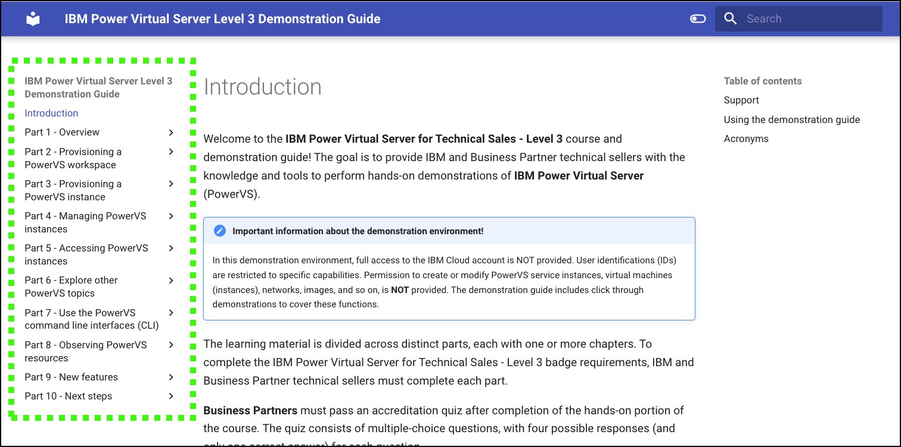
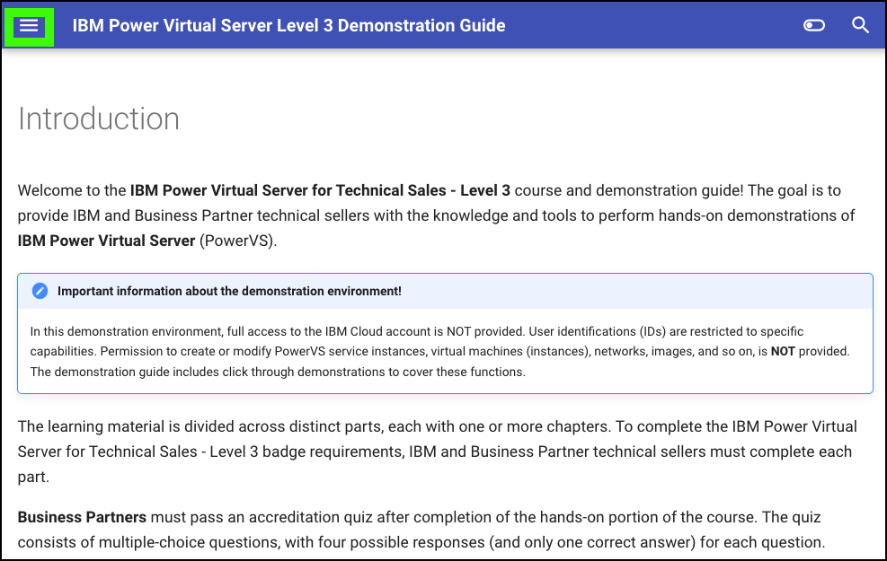
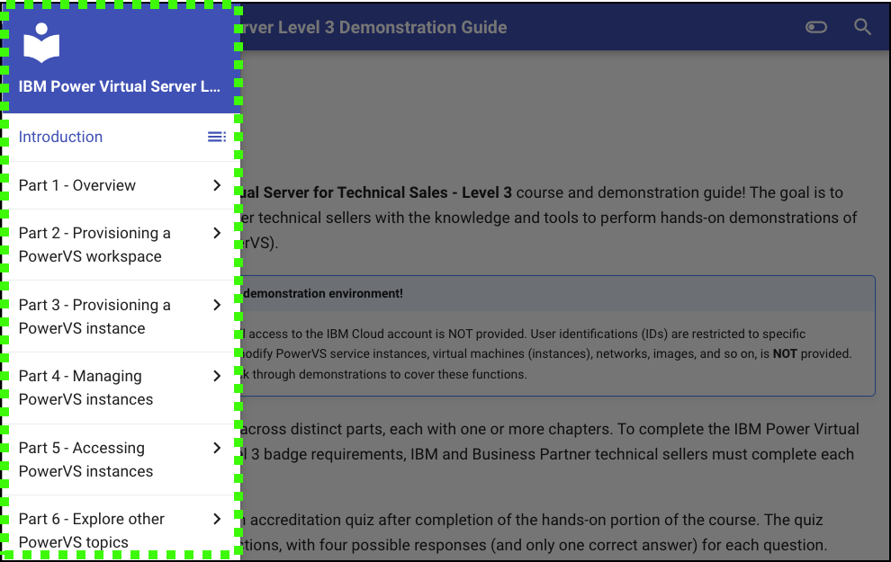

## Using the demonstration guide

Use these helpful tips to take full advantage of the IBM Power Virtual Server Level 3 guide.

The {{guide.name}} uses a reactive browser-based interface. The Demonstration Guide table of contents may be displayed as shown in this image.



However, if the browser window is sized smaller, the table of contents will only be accessible via the main menu icon ().



Click the main menu icon () to expand the table of contents.



The {{guide.name}} is organized in parts and chapters. Most chapters contain numbered steps.
Throughout the guide, images are used as examples of the IBM Cloud Portal, IBM Cloud Shell, and PowerVS instance consoles.

!!! Warning
    The IBM Cloud Portal and {{offering.name}} changes regularly and can differ from the images that are captured here.

??? tip "Printing the demonstration guide"

    Need a physical copy? Looking for a printable version? Want a PDF version?<br>
    Use the ['Print Course'](https://dpkshetty.github.io/TEST-SalesEnablement-PowerVS-L3/print_page/){target="_blank"} option in the navigation bar to access a print-ready version of the course for offline study.<br>You can use your browser's **File > Print > Save to PDF** option to save the whole course into a single PDF.
 

??? tip "Viewing images"

    Images in the demonstration guide can be enlarged by clicking the image. Press the ++esc++ key or click the **X** to close the enlarged image.
 
??? tip "Image highlighting"

    In some images, the following styles of highlighting are used:

    - **Solid highlight box**: This style of box highlights where to click, enter, or select an item.
    

??? tip "Copying commands and prompts"

    Copying and pasting commands and prompts from this demonstration guide is easy and can eliminate typographical errors.

    Click the highlighted copy icon and then use your operating system's paste function. For example, ++ctrl+v++, or right-click and select ```Paste``` option.
    
    

