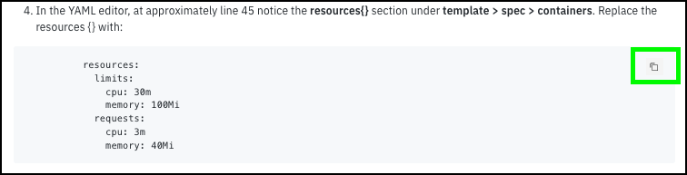
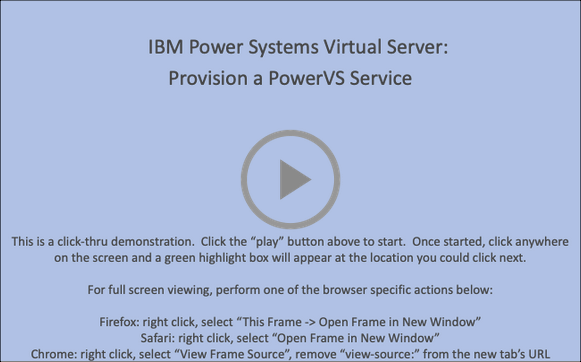
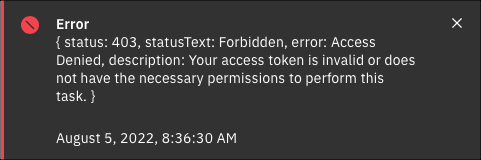

!!! tip "Ways to Watch"
    In addition to the embedded video, IBMers and Business Partners can also <a href="https://ibm.seismic.com/Link/Content/DCGdHJ7DMdqHD8cV7Wp8f4Rg9Bgd" target="_blank">download the recording from Seismic</a>.

Welcome to the IBM Power Systems Virtual Server - Level 3 course and demonstration guide! The goal is to provide IBM and Business Partner Sales and Technical Sales with the knowledge and tools to perform hands-on demonstrations of IBM Power Systems Virtual Server (PowerVS).

The learning material is broken up across distinct chapters. To complete the IBM Power Systems Virtual Server - Level 3 badge requirements, IBM and Business Partner sellers must complete Parts 1, 2, 3, 4, 5, and 8 of this demonstration guide. IBM and Business Partner technical sellers must complete all sections. **All are welcome and encouraged to complete all sections.**

All modules are accompanied by recordings and narrated instructions, delivered by your team of authors. Be sure to watch these for a visual demonstration of how to perform the hands-on lab components. In particular, **it is strongly recommended that IBM Sellers and Technical Sellers watch these recordings** — they will be useful for you as you go about creating and recording your own Stand & Deliver presentations for Level 3 accreditation.

!!! tip "IMPORTANT"
    To receive Level 3 accreditation, IBMers and Business Partners must demonstrate mastery of the skills learned throughout the various modules of these hands-on labs and coursework. Level 3 accreditation requirements— and the way participants will be evaluated before receiving accreditation —differs depending on job role.

**Business Partners** must pass an accreditation quiz after completing the hands-on portion of the course. The quiz consists of multiple choice questions, with four possible responses (and only one correct answer) for each question.

**IBM Sales and Tech Sales** must develop and record a Stand & Deliver presentation. This video is intended to simulate your delivery of a “live” demo in front of a client — on camera. IBMers will have flexibility in defining a hypothetical client, the pain points that customer has, and the goals they aspire. The recording will then cover the seller’s hands- on demonstration and pitch to the client of the value of the IBM solution using the environments and techniques of this lab.

Specific criteria that must be demonstrated as part of the Stand & Deliver recordings is provided within the documentation that accompanies the Level 3 course. Before jumping to part 1, please read the guidance below. Reading and understanding the information will save time while completing the steps in this guide.

!!! tip "FIND HELP"
    If at any point during the hands-on material you need help from the team of authors and other IBM experts, please connect with us via the <a href="https://ibm-technology-sales.slack.com/archives/C03PQ47KRQE" target="_blank">#cloud-platform-demo-feedback</a> Slack channel. Any comments or suggestions are also welcome in this channel.

## Helpful tips for using this demonstration guide and environment

The {{guide.name}} is organized in parts and sub-parts or chapters. Most chapters contain numbered steps, which are actions to be performed.

Throughout the guide, images are used as examples of the IBM Cloud Portal, IBM Cloud Shell, and PowerVS instance consoles.

!!! warning
    The IBM Cloud Portal and {{offering.name}} changes on a regular basis and may differ from the images captured in this guide.

In some images, the following styles of highlighting are utilized:

- Action highlight box: Illustrates where to click, enter, or select an item:

- Path/explore highlight box: Illustrates one of two things:

    - the path to follow to get to a specific location in the user interface
    - areas to explore

- Copy to clipboard box: The text is copied to the clipboard. Click the copy icon (highlighted below) and then paste using the operating systems paste function, for example, entering ++ctrl++**+v**, ++cmd++**+v**, or right click and select paste.

Additionally, there are several "click-thru" demonstrations. Links to click-thru demonstrations will open in a new browser window or tab with a screen similar to the image below.

Click the play button  in the middle of the screen to start the demo. Then, simply follow the steps in the demonstration guide. If unsure where to click, click anywhere on the screen and a highlight box will appear showing where to click next.

**In this demonstration environment, full access to the IBM Cloud account is NOT provided.** User identifications (IDs) will be restricted to specific capabilities. Permission to create or modify PowerVS service instances, virtual machines (instances), networks, images, etc. is not provided.

!!! warning
    Attempting to perform an action without the appropriate permissions will result in an error message like the one below. This is not an issue with the IBM Cloud or PowerVS, rather a restriction of the demo environment and the permissions assigned to users.

    

## Acronyms

The following acronyms are used throughout this demonstration guide:

    - Application programming interfaces (APIs)
    - Classless inter-domain routing (CIDR)
    - Control (ctrl) - The control key on keyboard
    - Command (cmd) - The command key on keyboard
    - Disaster Recovery (DR)
    - Gigabyte (GB)
    - High Availability (HA)
    - IBM Cloud Object Storage (COS)
    - IBM Power Systems Virtual Server (PowerVS)
    - IBM Technology Zone (TechZone)
    - Infrastructure as a Service (IaaS)
    - Input/output operations per second (IOPs)
    - Internet Protocol (IP)
    - Operating System (OS)
    - Random access memory (RAM)
    - Secure Socket Shell (SSH)
    - User identification (ID)
    - Virtual Machine (VM)

It is now time to proceed to Part 1, an overview of {{offering.name}}.
