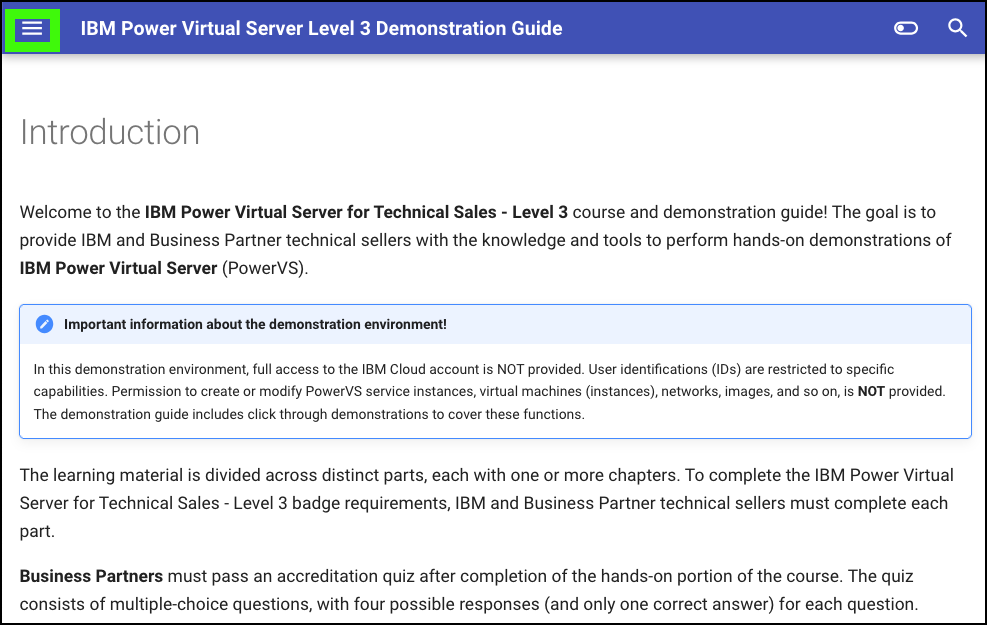

Welcome to the **{{learningplan.name}}** course and demonstration guide! The goal is to provide IBM and Business Partner technical sellers with the knowledge and tools to perform hands-on demonstrations of **{{offering.name}}** (PowerVS).

!!! Important "Important information about the demonstration environment!"
    In this demonstration environment, full access to the IBM Cloud account is NOT provided. User identifications (IDs) are restricted to specific capabilities. Permission to create or modify PowerVS service instances, virtual machines (instances), networks, images, and so on, is **NOT** provided. The demonstration guide includes click through demonstrations to cover these functions.

The learning material is divided across distinct parts, each with one or more chapters. To complete the {{learningplan.name}} badge requirements, IBM and Business Partner technical sellers must complete each part.

**Business Partners** must pass an accreditation quiz after completion of the hands-on portion of the course. The quiz consists of multiple-choice questions, with four possible responses (and only one correct answer) for each question.

**IBMers** must develop and record a Stand & Deliver presentation. This recorded video is intended to simulate delivery of a “live” demo in front of a client. IBMers have the flexibility to define a hypothetical client, the challenges the client has, and the goals they aspire to achieve. Specific criteria that must be demonstrated as part of the Stand & Deliver recordings are provided within the documentation that accompanies the Level 3 course. 

The following guidance helps save time in completing the demonstration steps.

## Support

Think something is down? Check the applicable status pages for current updates:

-  <a href="https://techzone.status.io/" target="_blank">IBM Technology Zone</a>
-  <a href="https://cloud.ibm.com/status" target="_blank">IBM Cloud</a>

For issues with provisioning or accessing the environment in IBM Technology Zone (ITZ) open a ticket with ITZ support:
- Web:  <a href="https://ibmsf.force.com/ibminternalproducts/s/createrecord/NewCase?language=en_US" target="_blank">IBM Technology Zone</a>
- Email: <a href="mailto:techzone.help@ibm.com" target="_blank">techzone.help.ibm.com</a>

For issues related to specific steps found in the demonstration guide after the ITZ environment is provisioned, contact the authors:

- Slack: <a href="{{supportSlack.url}}" target="_blank">{{supportSlack.name}}</a> - IBM only
- Email: <a href="{{supportEmail}}" target="_blank">{{supportEmail}}</a>

Business Partners can also use the IBM Training live Chat Support service or other support methods that are found on the IBM Training portal <a href="https://ibmcpsprod.service-now.com/its?id=sc_category&sys_id=6568bfafdb2f13008ea7d6fa4b961990" target="_blank">here</a>.

## Using the demonstration guide

 The {{guide.name}} uses a reactive browser-based interface. The Demonstration Guide table of contents may be displayed as shown in this image.

However, if the browser window is sized smaller, the table of contents will only be accessible via the main menu icon ().

Click the main menu icon () to expand the table of contents.

The {{guide.name}} is organized in parts and chapters. Most chapters contain numbered steps.
Throughout the guide, images are used as examples of the IBM Cloud Portal, IBM Cloud Shell, and PowerVS instance consoles.

!!! Warning
    The IBM Cloud Portal and {{offering.name}} changes regularly and can differ from the images that are captured here.

In some images, the following styles of highlighting are used:

- Action highlight box: Illustrates where to click, enter, or select an item:

    

- Path or "explore more" highlight box illustrates one of two things:

    - the path to follow to get to a specific location in the user interface
    - areas to explore

    

- Copy to the clipboard box: The text is copied to the clipboard. Click the copy icon and then paste with the operating system's paste function. For example, entering ++ctrl++**+v**, ++cmd++**+v**, or right click and select paste.

    

Also, several "click through" demonstrations are included. Links to click through demonstrations open in a new browser window or tab.

Click **play**  in the middle of the screen to start the demo. Then, follow the steps in the demonstration guide. Not sure where to click or what to do next? Click anywhere on the screen and the spot to click next is highlighted.

Just a reminder, **in this demonstration environment, full access to the IBM Cloud account is NOT provided.** User identifications (IDs) are restricted to specific capabilities. Permission to create or modify PowerVS service instances, virtual machines (instances), networks, images, and so on, is not provided.

!!! Warning
    Attempting to perform an action without the appropriate permissions results in an error message like the one that follows. This error is not an issue with IBM Cloud or PowerVS, rather a restriction of the demo environment and the permissions assigned to users.

    
    
## Acronyms

The following acronyms are used throughout this demonstration guide:

    - Application programming interfaces (APIs)
    - Classless inter-domain routing (CIDR)
    - Control (ctrl) - The control key on keyboard
    - Command (cmd) - The command key on keyboard
    - Disaster recovery (DR)
    - Gigabyte (GB)
    - High availability (HA)
    - IBM Cloud Object Storage (COS)
    - IBM Power Virtual Server (PowerVS)
    - IBM Technology Zone (TechZone)
    - Infrastructure as a Service (IaaS)
    - Input/output operations per second (IOPs)
    - Internet protocol (IP)
    - Operating system (OS)
    - Random access memory (RAM)
    - Reliability, Availability, and Serviceability (RAS)
    - Secure Socket Shell (SSH)
    - User identification (ID)
    - Virtual machine (VM)

It is now time to proceed to Part 1, an overview of {{offering.name}}.
